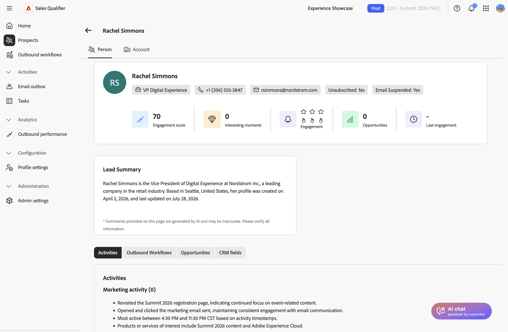
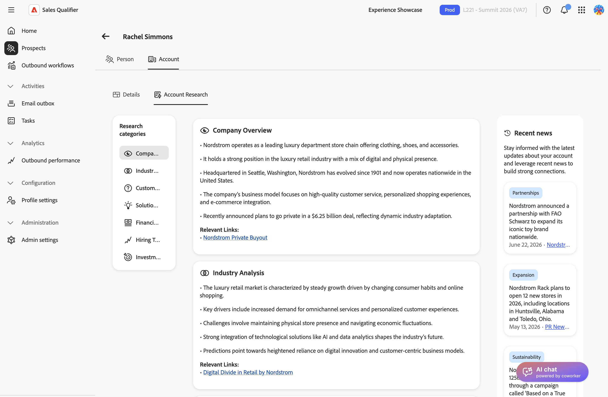

# Konten

Die Account-Ansicht kombiniert KI-generierte Forschung, aktuelle Nachrichten, offene Chancen, Pipeline-Wert und engagierte Kontakte. Verwenden Sie diese Informationen, um ein Konto zu verstehen und zu priorisieren, bevor Sie sich melden.

## Konto eröffnen

Eröffnen Sie ein Konto über das Profil eines Interessenten, der mit ihm verknüpft ist.

1. Wählen Sie **[!UICONTROL linken Navigationsbereich]** Interessenten“ aus und öffnen Sie einen Interessenten. Siehe [Interessenten](prospects.md).
1. Wählen Sie auf der Seite mit den Interessentendetails die Registerkarte **[!UICONTROL Konto]** aus.

{width="800" zoomable="yes"}

Sales Qualifier identifiziert das Konto anhand des CRM-Eintrags des potenziellen Kunden. Dieselbe Kontoansicht ist für jeden Interessenten verfügbar, der mit diesem Konto verknüpft ist. Wenn Sales Qualifier kein Konto zuordnen kann, wird auf der Registerkarte _Kein Konto gefunden_ angezeigt.

>[!NOTE]
>
>Die verfügbaren Abschnitte und Metriken hängen von Ihrem CRM, der Konfiguration Ihres Unternehmens und den Kontodaten ab. Wenn ein hier beschriebener Abschnitt nicht angezeigt wird, sind die erforderlichen Daten oder Funktionen nicht konfiguriert.

Die Kontoansicht weist zwei Registerkarten auf: **[!UICONTROL Details]** und **[!UICONTROL Kontoforschung]**.

## Überprüfen der Kontodetails

Auf **[!UICONTROL Registerkarte]** Details“ erhalten Sie einen Schnappschuss des Kontos und seiner Pipeline.

### Kontoübersicht

Die Übersichtskarte oben auf der Registerkarte identifiziert das Konto und fasst seinen Wert zusammen:

* Der Kontoname und die Region
* **Jährlicher wiederkehrender Umsatz (ARR)** - Der jährliche wiederkehrende Umsatz aller aktiven Abonnements. Wählen Sie **[!UICONTROL Alle anzeigen]** aus, um den jährlichen **[!UICONTROL nach Produkt im Dialogfeld „Jährlicher]**&quot; zu überprüfen.
* Kontostatistiken, einschließlich der Anzahl der offenen Opportunities und Kontakte und des Pipeline-Werts

### Kontoübersicht - Zusammenfassung

Das Bedienfeld **[!UICONTROL Kontoübersicht]** fasst den Account basierend auf CRM-Daten und Account Qualification Agent-Recherchen zusammen. Wenn recherchiert wird, zeigt das Bedienfeld den Ladestatus an. Wenn keine Recherche verfügbar ist, zeigt das Bedienfeld eine Meldung an.

### Account Insights

Verwenden Sie die Schaltflächen unter der Übersicht, um zwischen Kontoansichten zu wechseln. Die verfügbaren Ansichten hängen von Ihrem CRM und Ihrer Konfiguration ab:

| Anzeigen | Was angezeigt wird |
| --- | --- |
| **[!UICONTROL Opportunities]** | Offene, mit dem Account verknüpfte Opportunities mit jeweils zugehörigen Schlüsselfeldern. Wählen Sie **[!UICONTROL Alle anzeigen]**, um die vollständige Liste in einer Tabelle anzuzeigen. Opportunity-Details wie Phase, Typ und Abschlussdatum können auch verwendet werden, um die Kontakte des Kontos unter &quot;**[!UICONTROL Opportunity-Kontakte“]** filtern, wenn ein Administrator diese Felder filterbar macht. |
| **[!UICONTROL Top-Mitglieder]** | Die am häufigsten kontaktierten Kontakte des Kontos, sortiert nach Interaktion. Jeder Kontakt zeigt seinen Jobtitel, seine E-Mail-Adresse, seinen Interaktionswert und die Dringlichkeitsanzeige an. |
| **[!UICONTROL Intent-Daten]** | Kaufabsichtssignale für das Konto, z. B. die Produkte und Themen, nach denen das Konto sucht. |
| **[!UICONTROL Mitglieder des Konto-Teams]** | Dem Konto zugewiesene Personen mit ihrer E-Mail-Adresse, ihrer Stellenbezeichnung, ihrem Gebiet und ihrer Produktgruppe. |
| **[!UICONTROL CRM-Felder]** | Kontofelder aus Ihrem CRM importiert, wie in der eingehenden Zuordnung konfiguriert. Siehe [Integrationen](integrations.md#map-crm-fields-inbound-mapping). |

Führen Sie in **[!UICONTROL Ansicht]** Top-Mitglieder“ eine der folgenden Aktionen für einen Kontakt aus:

* **[!UICONTROL Zu ausgehendem Workflow hinzufügen]** - Registrieren Sie den Kontakt in einem [ausgehenden Workflow](outbound-workflows.md).
* **[!UICONTROL Zu Marketo-Kampagne hinzufügen]** - Trigger einer [!DNL Marketo] für den Kontakt.

## Konto recherchieren

Die Registerkarte **[!UICONTROL Account Research]** enthält drei Bereiche:

* **[!UICONTROL Forschungskategorien]** - Forschungsthemen. Wählen Sie eine Kategorie aus, um ihre Forschung im mittleren Bereich anzuzeigen.
* **Forschungsinhalt** - KI-generierte Forschungskarten, gruppiert nach Kategorie. Eine Karte kann die Quell-Domain und das Datum enthalten, an dem das Signal zum ersten Mal und zuletzt erkannt wurde.
* **[!UICONTROL Aktuelle Nachrichten]** - Aktuelle Nachrichten zum Konto, einschließlich Datumsangaben, Tags und Quell-Links.

{width="800" zoomable="yes"}

Wenn Recherche oder Nachrichten nicht geladen werden können, bietet jeder Bereich eine **[!UICONTROL Neu laden]**-Aktion, um es erneut zu versuchen.

## Nutzen von Account Intelligence für die Kontaktaufnahme

Account Intelligence ist am wertvollsten, wenn sie prägt, was Sie senden:

* Referenzieren Sie ein aktuelles Nachrichtenelement oder Forschungssignal, um Ihre Eröffnung relevant zu machen, anstatt eine allgemeine Tonhöhe zu verwenden.
* Überprüfen Sie die offenen Opportunities und den Pipeline-Wert, um zu entscheiden, ob Sie das Konto priorisieren möchten.
* Verwenden Sie **[!UICONTROL Top-Mitglieder]** um zu identifizieren, an wen sie sich wenden sollen, und registrieren Sie sie dann für einen ausgehenden Workflow.
* Bitten Sie [AI Chat](ai-assistant.md) vor einem Anruf die Positionierung für das Konto zu entwickeln.

>[!MORELIKETHIS]
>
>* [Interessenten](prospects.md)
>* [Ausgehende Workflows](outbound-workflows.md)
>* [AI-Chat](ai-assistant.md)
