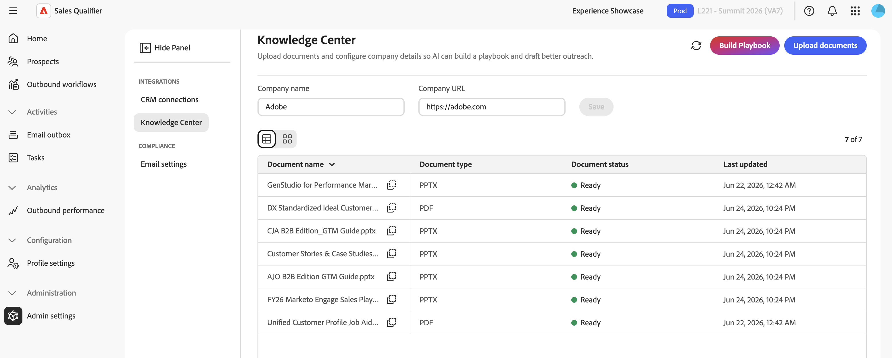

# Admin-Einstellungen

Verwenden Sie **[!UICONTROL Admin-Einstellungen]** um CRM-Integrationen zu konfigurieren, das Wissenscenter zu verwalten und E-Mail-Opt-outs zu konfigurieren.

Sales Qualifier stellt eine Verbindung zu Salesforce oder Microsoft Dynamics 365 her. Durch diese Verbindung erhält die Account Qualification Agent (AQA) eine konsistente Ansicht von Leads, Konten, Kontakten, Aktivitäten und Eigentümern. Sales Qualifier kann auch Outreach-Aktivitäten und den Opt-out-Status zurück in das CRM schreiben und Outreach-Aktivitäten mit Marketo synchronisieren.

Die CRM-Verbindungen, die Feldzuordnung und die Aktivitätssynchronisierung konfigurieren Sie unter **[!UICONTROL Administration]** > **[!UICONTROL Admin-Einstellungen]** > **[!UICONTROL CRM-Verbindungen]**. Standardbenutzer können die konfigurierten CRM-Daten und -Filter verwenden, diese Einstellungen jedoch nicht ändern. Informationen zum erstmaligen Verbinden eines CRM-Systems finden Sie unter [Erste Schritte](getting-started.md#connect-your-crm).

>[!IMPORTANT]
>
>Der Zugriff auf **[!UICONTROL Admin]** Einstellungen erfordert die Mitgliedschaft in den Benutzergruppen `Sales Qualifier` und `Sales Qualifier Admins`.

## CRM MCP und das eingebettete Plug-in

Sales Qualifier arbeitet auf folgende Weise mit Ihrem CRM-System:

* **CRM-MCP** Abfragen: Live-CRM-Daten von Account Qualification Agent werden abgefragt, damit Antworten und Einblicke den aktuellen Status Ihrer Datensätze widerspiegeln.
* **Eingebettetes Plug-in** - Das CRM-Plug-in zeigt [!DNL Marketo Sales Insights] (MSI)-Einblicke und agentische Daten in Ihrem CRM an. Verwenden Sie das Plug-in, um einen potenziellen Kunden zu Sales Qualifier hinzuzufügen.
* **Aktivitätssynchronisierung** Wenn ein Administrator die Option **[!UICONTROL Aktivitätssynchronisierung]** aktiviert, werden die Outreach-Aktivitäten mit dem CRM und Marketo synchronisiert.

## CRM-Zugriffsbereich

Sales Qualifier liest Benutzer, Kontakte, Besitzerzuordnungen, Leads, Konten, Chancen und Aktivitäten aus dem CRM. Es werden nur protokollierte Outreach-Aktivitäten und der Opt-out-Status in das CRM geschrieben und Outreach-Aktivitäten werden mit Marketo synchronisiert. Ihr CRM-Administrator bereitet den API-Zugriff in Salesforce oder Dynamics vor. Ein Sales Qualifier-Administrator verbindet dann das CRM, ordnet eingehende Felder zu und entscheidet, ob die Aktivitäten synchronisiert werden sollen.

>[!NOTE]
>
>Die Schritte zur Anmeldung in [Erste Schritte](getting-started.md#connect-your-crm) beschreiben den Lesezugriff auf CRM-Objekte. Wenn Sie die Aktivitätssynchronisierung oder das Opt-out-Writeback aktivieren, wenden Sie sich an Ihren CRM-Administrator, um ihm den entsprechenden für Ihre CRM-Konfiguration erforderlichen Schreibzugriff zu gewähren.

## CRM-Felder zuordnen (eingehende Zuordnung)

Nachdem das CRM verbunden ist, wählen Sie **[!UICONTROL Verwalten]** für die Verbindung aus und öffnen Sie **[!UICONTROL Eingehende Zuordnung]**. Eingehende Zuordnungen steuern, welche CRM-Felder Sales Qualifier in die Anwendung holt.

1. Wählen Sie **[!UICONTROL Abschnitt hinzufügen]** aus.
1. Geben Sie einen Namen und eine Beschreibung für den Abschnitt ein.
1. Einen Entitätstyp auswählen. **[!UICONTROL Interessenten]** ist standardmäßig ausgewählt. **[!UICONTROL Kontakte]**, **[!UICONTROL Konten]** und **[!UICONTROL Opportunities]** sind ebenfalls verfügbar.
1. CRM-Felder zum Importieren auswählen.

   Jede Feldzeile zeigt ihren **[!UICONTROL Anzeigenamen]**, **[!UICONTROL Feldname]** und **[!UICONTROL Datentyp]** an.

1. Aktivieren **[!UICONTROL Filterbar]** für jedes Feld eines Interessenten, Kontakts oder einer Opportunity, das bzw. die Sie als Filter in der Liste **[!UICONTROL Interessenten]** verfügbar machen möchten.
1. Zeigen Sie eine Vorschau des Abschnitts an und wählen Sie **[!UICONTROL Hinzufügen]**.

Zugeordnete Felder werden in den entsprechenden Bereichen von Sales Qualifier angezeigt:

* Felder für Interessenten werden auf der Registerkarte **[!UICONTROL Person]** angezeigt.
* Kontofelder werden auf der Registerkarte **[!UICONTROL Konto]** angezeigt.
* Die Felder für die Opportunity werden im Abschnitt **[!UICONTROL Account-Opportunity]** angezeigt. Filterbare Opportunity-Felder werden auch als eigene Spalten in **[!UICONTROL Meine Opportunity-Kontakte]** mit Bezeichnungen wie **[!UICONTROL Phase (Opportunity)]** angezeigt, um sie von Kontaktfeldern zu unterscheiden.

## Aktivitätssynchronisierung konfigurieren (ausgehende Zuordnung)

1. Wählen Sie **[!UICONTROL CRM-Verbindungen]** die Option **[!UICONTROL Verwalten]** für das verbundene CRM aus.
1. Öffnen Sie **[!UICONTROL Ausgehende Zuordnung]**.
1. Aktivieren Sie **[!UICONTROL Aktivitätssynchronisierung]** um Sales Qualifier-Outreach-Aktivitäten mit dem CRM und Marketo zu synchronisieren. Die Aktivitäten „Gesendet“, „Geöffnet“, „Klickt“ und „Antwort“ enthalten den Namen des ausgehenden Workflows.

Wenn die Aktivitätssynchronisierung deaktiviert ist, verwendet Sales Qualifier weiterhin eingehende CRM-Daten, synchronisiert jedoch keine Outreach-Aktivitäten mit dem CRM oder Marketo.

## Erstellen eines Playbooks für Wissenszentren {#knowledge-center}

Das **[!UICONTROL Knowledge Center]** bietet der Account Qualification Agent (AQA) Zugriff auf Ihre Verkaufsunterlagen. Sales Qualifier verwendet diese Materialien, um Forschungen, Qualifizierungseinblicke und Öffentlichkeitsarbeit zu generieren, die widerspiegeln, wie Ihr Unternehmen verkauft. Nur Administratoren können das Playbook erstellen und verwalten.

{width="800" zoomable="yes"}

1. Erweitern Sie in der linken Navigation **[!UICONTROL Administration]** wählen Sie **[!UICONTROL Admin-Einstellungen]** und wählen Sie **[!UICONTROL Wissenszentrum]**
1. u
1. Legen Sie die **[!UICONTROL Firmenname]** und **[!UICONTROL Unternehmens-URL]** fest, die Sales Qualifier verwendet, um Ihr Unternehmen zu durchsuchen und E-Mails zu entwerfen.
1. Laden Sie Vertriebsmitteilungen, ideale Kundenprofile (ICPs), Positionierungsleitfäden und anderes Vertriebsmaterial im PDF-, PPTX- oder DOCX-Format hoch.
1. Wählen Sie **[!UICONTROL Playbook erstellen]** aus.

Jedes hochgeladene Dokument zeigt seinen Verarbeitungsstatus an, z **[!UICONTROL B. &quot;]**&quot; und den Zeitpunkt der letzten Aktualisierung.

>[!NOTE]
>
>Die Verarbeitung eines Playbooks kann bis zu 24 Stunden dauern.

Wenn das Playbook fertig ist, können Vertreter es an zwei Stellen verwenden:

* **Ausgehende E-Mail-Eingabeaufforderungen** - Benennen Sie in einer Touchpoint-Eingabeaufforderung das Dokument und beschreiben Sie den zu verwendenden Kontext. Geben Sie beispielsweise `Use the ABC positioning guide from the Knowledge Center and focus on the security value proposition` ein. Siehe [Erstellen und Überprüfen von Touchpoints](outbound-workflows.md#step-3-generate-and-review-touchpoints).
* **AI Chat**: Wenden Sie sich in Ihrer Frage an das Knowledge Center. Geben Sie beispielsweise `From the Knowledge Center, help me position our security solution for ABC Corp before tomorrow's call` ein. Siehe [KI-Chat](ai-assistant.md).

In beiden Fällen spiegelt der generierte Inhalt die Botschaft in Ihrem Playbook wider und nicht die allgemeine Forschung.

## Konfigurieren des globalen E-Mail-Opt-outs

1. Erweitern Sie in der linken Navigation **[!UICONTROL Administration]** und wählen Sie **[!UICONTROL Admin-Einstellungen]** aus.
1. Wählen Sie **[!UICONTROL E-Mail]** Einstellungen unter **[!UICONTROL Compliance]** aus.
1. Aktivieren Sie **[!UICONTROL Ausschluss-Link in jeder E-Mail einschließen]** um eine Fußzeile zur Abmeldung an ausgehende E-Mails anzuhängen.
1. Geben **[!UICONTROL in der Opt]** out-Nachrichtenvorlage den Fußzeilentext ein. Fügen Sie das `{opt_out_link}`-Token ein, in dem der Abmelde-Link angezeigt werden soll.

Die Einstellungen werden automatisch gespeichert.

Wenn ein Interessent den Link auswählt, sendet Sales Qualifier keine E-Mails mehr an diesen Interessenten und synchronisiert den Opt-out-Status mit dem verbundenen CRM.

## Referenz: Beispiel-API-Parameter

Ihr CRM-Team kann diese Beispiele verwenden, um zu bestätigen, dass der Lesezugriff die erwarteten Lead-Felder zurückgibt.

### Dynamics OData-Beispiel

```text
$select=fullname,_ownerid_value,leadid,emailaddress1,jobtitle,statuscode,createdon,modifiedon,statecode
$filter=_ownerid_value eq '<crmUserId>' [AND additional filters]
$expand=Lead_ActivityPointers(...),parentaccountid(...)
$orderby=modifiedon desc
```

### Salesforce SOQL-Beispiel

```sql
SELECT Id, Salutation, FirstName, LastName, Name, Title, Company, Email,
  LeadSource, Status, OwnerId, LastModifiedDate, LastActivityDate, CreatedDate,
  (SELECT Id, Subject, ActivityDate, Status FROM Tasks ORDER BY ActivityDate DESC LIMIT 1),
  (SELECT Id, Subject, ActivityDateTime FROM Events ORDER BY ActivityDateTime DESC LIMIT 1)
FROM Lead
WHERE OwnerId = '<crmUserId>' AND IsDeleted = false
ORDER BY LastModifiedDate DESC
```

>[!MORELIKETHIS]
>
>* [Erste Schritte](getting-started.md)
>* [Interessenten](prospects.md)
