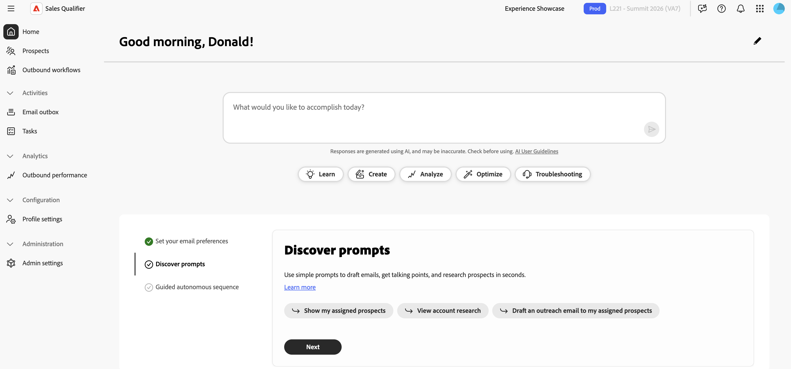

# Erste Schritte mit Sales Qualifier

Nachdem Adobe Sales Qualifier für Ihr Unternehmen bereitgestellt hat, muss ein [!DNL Marketo]-Systemadministrator die erforderlichen Benutzergruppen erstellen und Salesforce oder Microsoft Dynamics 365 verbinden.

{width="800" zoomable="yes"}

## Einrichten von Benutzergruppen

Benutzergruppen in Adobe Admin Console werden verwendet, um den Zugriff auf Sales Qualifier zu steuern. Beide Gruppen müssen erstellt werden, bevor sich Benutzer anmelden können.

Informationen zum Einrichten von Gruppen finden [&#128279;](https://helpx.adobe.com/business/enterprise/users/users-and-groups/user-groups.html) in der Dokumentation zu Adobe Admin Console .

>[!PREREQUISITES]
>
>Der Administrator, der die Gruppen erstellt, muss die beiden folgenden Anforderungen erfüllen:
>
>* Sie müssen ein Organisationsadministrator sein, der über den Adobe-App-**Zugriff auf** Admin Console hat.
>* Sie müssen das Adobe Experience Platform-Produkt verwenden oder Systemadministrator sein. Andernfalls wird Adobe Experience Platform nicht in der Produktliste angezeigt.

### Sales Qualifier-Benutzer

Benutzer müssen der Benutzergruppe `Sales Qualifier` angehören, um auf das Programm zugreifen zu können.

Diese Schritte werden in der Adobe Admin Console ausgeführt.

1. Wählen Sie im Programmumschalter mit neun Punkten **[!UICONTROL Admin Console]** aus.
1. Wählen **[!UICONTROL Benutzer]** > **[!UICONTROL Benutzergruppen]** > **[!UICONTROL Neue Benutzergruppe]**.
1. Geben Sie `Sales Qualifier` als Gruppennamen ein und wählen Sie **[!UICONTROL Speichern]**.
1. Öffnen Sie **[!UICONTROL Zugewiesene Produktprofile]** und wählen Sie **[!UICONTROL Profil zuweisen]** aus.
1. **[!UICONTROL Adobe Experience Platform]**.
1. Wählen Sie das Produktprofil **[!UICONTROL Standardproduktion -]**), dann **[!UICONTROL Anwenden]** und anschließend **[!UICONTROL Speichern]** aus.
1. Öffnen Sie **[!UICONTROL Benutzer]** und wählen Sie **[!UICONTROL Benutzer hinzufügen]** aus, um alle hinzuzufügen, die Zugriff auf Sales Qualifier benötigen.

### Sales Qualifier-Administratoren

Administratoren, die CRM-Verbindungen, das [Wissenscenter](admin-settings.md#knowledge-center) und globale E-Mail-Opt-out-Einstellungen konfigurieren, müssen ebenfalls zur `Sales Qualifier Admins` Benutzergruppe gehören.

1. Wählen Sie in Adobe Admin Console **[!UICONTROL Benutzer]** > **[!UICONTROL Benutzergruppen]** > **[!UICONTROL Neue Benutzergruppe]**.
1. Geben Sie `Sales Qualifier Admins` als Gruppennamen ein und wählen Sie **[!UICONTROL Speichern]**.
1. Öffnen Sie **[!UICONTROL Benutzer]**, wählen Sie **[!UICONTROL Benutzer hinzufügen]** aus und fügen Sie die Administratoren hinzu.
1. Vergewissern Sie sich, dass alle Admins auch Mitglieder der `Sales Qualifier` sind.

Die Mitgliedschaft in beiden Gruppen macht **[!UICONTROL Admin-Einstellungen]** im linken Navigationsbereich unter **[!UICONTROL Administration]** sichtbar. Standardbenutzer arbeiten mit den Feldern, Filtern und Playbooks, die Administratoren konfigurieren. Die konfigurierte Opt-out-Fußzeile wird automatisch auf die ausgehenden E-Mails angewendet. Standardbenutzer können diese Einstellungen nicht ändern.

Die Namen der Benutzergruppen müssen genau mit denen übereinstimmen, die in den vorherigen Schritten gezeigt wurden.

Sie können auch eine optionale `Sales Qualifier BDR managers` erstellen. Mitglieder dieser Gruppe können auf E-Mail-Leistungsberichte zugreifen.

## CRM verbinden

Sales Qualifier stellt eine Verbindung zu Salesforce oder Microsoft Dynamics 365 her, um BDRs eine einheitliche Ansicht von Benutzern, Leads, Kontakten, Konten, Opportunities, Eigentümerzuordnungen und zugehörigen Aktivitäten zu bieten. Für die erstmalige Verbindung ist ein schreibgeschützter Zugriff auf diese CRM-Daten erforderlich. Bereiten Sie die Anmeldeinformationen gemeinsam mit Ihrem CRM-Administrator vor, bevor Sie eine Verbindung mit Sales Qualifier herstellen. Siehe [Integrationen](integrations.md) für Integrationsdetails.

>[!PREREQUISITES]
>
>Um auf die CRM-Verwaltungsoberfläche zugreifen zu können, müssen Sie der `Sales Qualifier Admins` Adobe Admin Console-Gruppe und der `Sales Qualifier`-Gruppe angehören.

>[!BEGINTABS]

>[!TAB Salesforce]

Ein Salesforce-Systemadministrator erstellt eine externe Client-Anwendung (auch als verbundene Anwendung bezeichnet) und konfiguriert deren ausführbaren Benutzer.

>[!PREREQUISITES]
>
>Vergewissern Sie sich, dass der Salesforce-Administrator über die folgenden Berechtigungen verfügt:
>
>* Programm anpassen
>* Setup und Konfiguration anzeigen
>* Alle Daten ändern
>* Verwalten von verbundenen Apps
>
>Ohne _Verbundene Apps verwalten_ kann der Administrator die Client-ID und das Client-Geheimnis nicht anzeigen.

1. Wechseln Sie in Salesforce zu **[!UICONTROL Setup]** > **[!UICONTROL App Manager]** und wählen Sie **[!UICONTROL Neue verbundene App]** oder **[!UICONTROL Neue externe Client-App]**.
1. Geben Sie einen Anwendungsnamen und die E-Mail-Adresse des Administrationskontakts ein.
1. Aktivieren Sie OAuth und geben Sie eine Callback-URL ein.

   Wenn die Verbindung keine Umleitung verwendet, geben Sie eine gültige URL ein.

1. Fügen Sie die folgenden OAuth-Bereiche hinzu:

   * Zugriff auf den Identity-URL-Service (`id`, `profile`, `email`, `address`, `phone`)
   * Verwalten von Benutzerdaten über APIs (`api`)
   * Zugriff auf eindeutige Benutzerkennung (`openid`)

1. Aktivieren Sie den Fluss der Client-Anmeldeinformationen und wählen Sie einen **[!UICONTROL Als ausführen]**-Benutzer aus.
1. Vergewissern Sie sich, dass der ausführbare Benutzer **Lesezugriff** auf `Leads`, `Accounts`, `Contacts`, `Tasks`, `Events`, `Opportunity`, `OpportunityContactRoles` und `OpportunityLineItems` hat. Bestätigen Sie außerdem, dass **Zugriffsaktivitäten** aktiviert ist.
1. Speichern Sie die Anwendung.
1. Öffnen Sie **[!UICONTROL App Manager]** die Anwendung und wählen Sie **[!UICONTROL Anzeigen]** > **[!UICONTROL Verbraucherdetails]**.
1. Kopieren Sie die folgenden Werte für die Sales Qualifier-Verbindung:

   * Consumer Key (Client ID)
   * Consumer Secret (Client Secret)
   * Callback-URL
   * Salesforce-Instanz-URL

Die Schritte können sich geringfügig von den hier beschriebenen unterscheiden. Weitere Informationen finden Sie in der [&#128279;](https://help.salesforce.com/s/) zu Salesforce.

### Suchen der Salesforce-Instanz-URL

1. Melden Sie sich an und notieren Sie sich _Subdomain Ihrer Organisation_ Meine Domain) in der Adressleiste des Browsers (der `{{mydomain}}`).
1. Verwenden Sie das kanonische Formular für Sales Qualifier: `https://{{mydomain}}.my.salesforce.com`.

Verwenden Sie keine `lightning.force.com` URL als Instanz-URL.

>[!TIP]
>
>Wenn die CRM-Verbindungsschnittstelle fehlende Bereiche meldet, überprüfen Sie das Profil des ausführbaren Benutzers unter **[!UICONTROL Standardobjektberechtigungen]** auf **Lesen** Zugriff auf Leads, Kontakte, Konten und Opportunities. Überprüfen Sie **[!UICONTROL Objekteinstellungen]** auch in jedem zugewiesenen Berechtigungssatz.

>[!TAB Microsoft Dynamics 365]

Ein Microsoft Dynamics 365- oder Azure-Administrator registriert eine Anwendung und fügt sie der Dynamics-Umgebung hinzu.

1. Wählen Sie unter Microsoft Entra ID **[!UICONTROL App-Registrierungen]** aus und registrieren Sie eine Anwendung.
1. Kopieren Sie die Client-ID und Mandanten-ID und erstellen Sie ein Client-Geheimnis.
1. Wählen Sie im **[!UICONTROL Power Platform Admin Center]** die Option **[!UICONTROL Umgebungen]** und öffnen Sie die Dynamics-Umgebung.
1. Gehen Sie zu **[!UICONTROL Einstellungen]** > **[!UICONTROL Benutzer + Berechtigungen]** > **[!UICONTROL Anwendungsbenutzer]** und wählen Sie **[!UICONTROL Neuer Anwendungsbenutzer]**.
1. Wählen Sie die registrierte Microsoft Entra-Anwendung aus.
1. Weisen Sie eine Sicherheitsrolle zu, die Lesezugriff auf Leads, Kontakte, Konten, Chancen und Aktivitäten gewährt.

   Eine Sicherheitsrolle ist erforderlich. Ohne eine kann die Anwendung nicht auf Dynamics-Daten zugreifen.

1. Erfassen Sie die Client-ID, das Client-Geheimnis, die Mandanten-ID und die Dynamics-Instanz-URL. Verwenden Sie das kanonische URL-Formular `https://{{mydomain}}.crm.dynamics.com`.

>[!ENDTABS]

### Geben Sie Ihre Verbindung ein

1. Melden Sie sich als Mitglied beider erforderlichen Sales Qualifier-Gruppen bei Sales Qualifier an und bestätigen Sie, dass die richtige Sandbox oder Umgebung ausgewählt ist.
1. Erweitern Sie in der linken Navigation **[!UICONTROL Administration]** und wählen Sie **[!UICONTROL Admin-Einstellungen]** aus.
1. Wählen Sie **[!UICONTROL CRM-Verbindungen]** unter **[!UICONTROL Integrationen]** aus.

   Auf der Seite werden Karten für Salesforce und Microsoft Dynamics angezeigt. Eine inaktive Verbindung zeigt **[!UICONTROL Verbinden]**. Eine konfigurierte Verbindung zeigt **[!UICONTROL Verbunden]** und **[!UICONTROL Verwalten]**.

   {width="800" zoomable="yes"}

1. Wählen Sie **[!UICONTROL Verbinden]** für das verwendete CRM aus.
1. Geben Sie die Anmeldedaten und die Instanz-URL von Ihrem CRM-Administrator ein.
1. Bestätigen Sie nach erfolgreicher Verbindung, dass auf der Karte &quot;**[!UICONTROL &quot;]**.

### CRM-Felder importieren

Nachdem Sie das CRM verbunden haben, konfigurieren Sie die eingehende Zuordnung, um zu bestimmen, welche CRM-Felder in Sales Qualifier angezeigt werden. Wählen Sie auf der verbundenen CRM-Karte **[!UICONTROL Verwalten]** aus, um **[!UICONTROL Eingehende Zuordnung]** zu öffnen, und fügen Sie dann einen Abschnitt für jeden Entitätstyp hinzu, dessen Felder Sie importieren möchten.

Siehe [Zuordnen von CRM-Feldern (eingehende Zuordnung)](integrations.md#map-crm-fields-inbound-mapping) für vollständige Schritte, einschließlich der Bereitstellung importierter Felder als Filter.

## Nächste Schritte

>[!MORELIKETHIS]
>
>* [Interessenten](prospects.md)
>* [Ausgehende Workflows](outbound-workflows.md)
