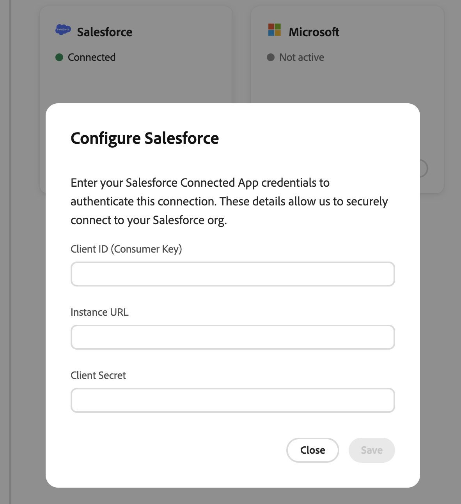
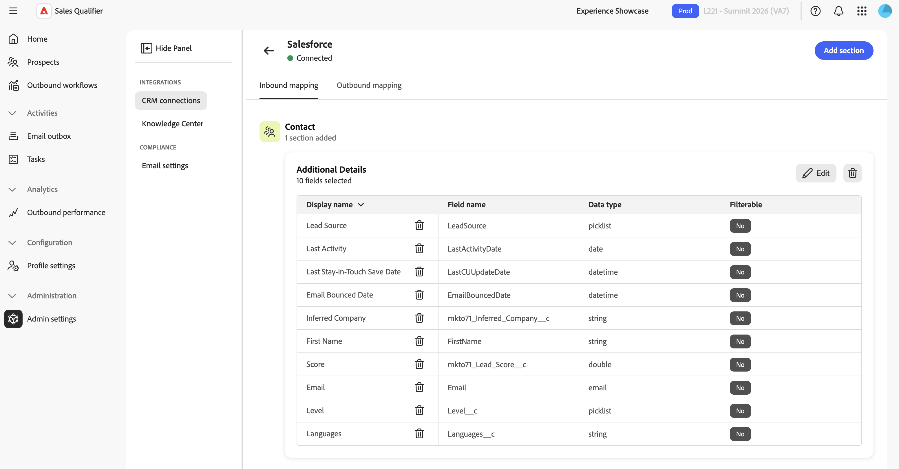
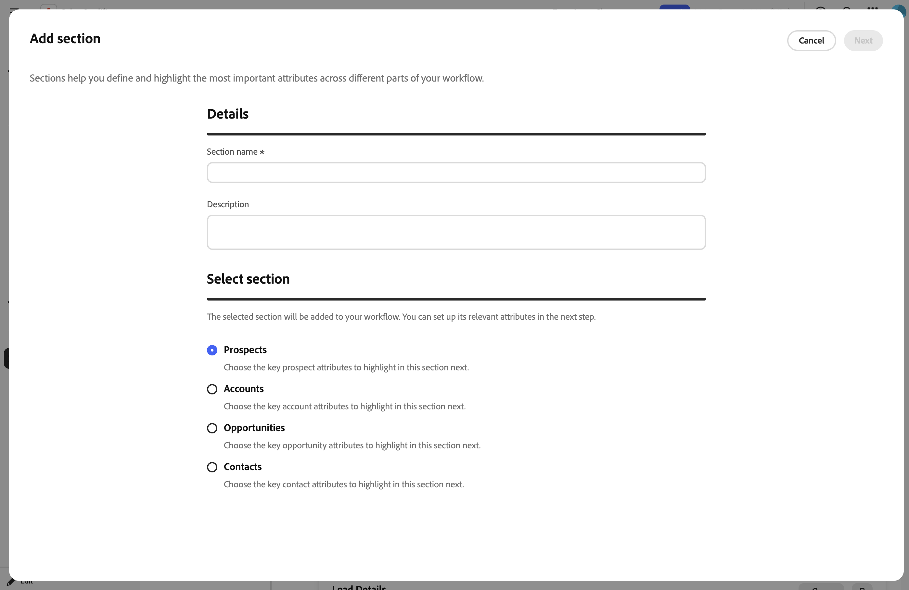

# Integrationen

Outlook verbinden, um E-Mails zu senden, Antworten von Interessenten zu erkennen und Meetings zu planen. Um Leads, Kontakte, Konten, Opportunities, Aktivitäten und Eigentümer für Account Qualification Agent (AQA) und ausgehende Workflows verfügbar zu machen, können Sie Adobe Marketo Qualifier auch mit Salesforce oder Microsoft Dynamics 365 verbinden. Marketo Qualifier liest CRM-Daten, kann Outreach-Aktivitäten und den Opt-out-Status zurück in das CRM schreiben und kann Outreach-Aktivitäten mit Marketo synchronisieren. Andernfalls werden CRM-Datensätze nicht geändert.

In diesem Artikel wird erläutert, wie Sie Outlook verbinden, eine CRM-Verbindung verwalten, Felder zuordnen, Aktivitäten synchronisieren und E-Mail-Opt-outs konfigurieren. Informationen zum erstmaligen Verbinden eines CRM-Systems finden Sie unter [Erste Schritte](getting-started.md#connect-your-crm).

>[!IMPORTANT]
>
>Die Outlook-Verbindung erfolgt pro Vertreter. Die CRM- und Compliance-Einstellungen, die weiter unten in diesem Artikel beschrieben werden, gelten für die gesamte Organisation. Um auf diese organisationsweiten Einstellungen zuzugreifen, müssen Sie der `Marketo Qualifier` und `Marketo Qualifier Admins` Benutzergruppen angehören. Standardbenutzer können die konfigurierten CRM-Daten und -Filter verwenden, aber die Einstellungen nicht ändern.

## Outlook verbinden

Jeder Mitarbeiter verbindet sein eigenes Outlook-Konto:

1. Wählen Sie **[!UICONTROL Outlook verbinden]**.
1. Melden Sie sich mit Ihrem Microsoft-Konto an.
1. Überprüfen und genehmigen Sie den angeforderten Zugriff.

Mit der -Verbindung kann Marketo Qualifier über Ihr Postfach senden, erkennen, wann ein Interessent antwortet, und Meetings in Ihrem Kalender planen.

Wenn Sie eine Verbindung herstellen, genehmigen Sie den Zugriff, der Marketo Qualifier Folgendes ermöglicht:

* Antworten von Interessenten erkennen.
* Erstellen und Senden von E-Mails in Ihrem Namen.
* Verwenden Sie Ihren Kalender, um Besprechungen zu planen.
* Zeitzone und Arbeitszeit des Postfachs für die Planung lesen
* Automatisch angemeldet bleiben, damit diese Funktionen weiterhin funktionieren, ohne dass Sie sich erneut anmelden müssen.

### Outlook-Genehmigungen (falls erforderlich)

Standardmäßig ist keine Administratoraktion erforderlich. Jeder Vertreter genehmigt den Zugriff für sich selbst, wenn er Outlook verbindet.

Wenn Ihr Unternehmen das Benutzereinverständnis für Drittanbieter-Apps in Microsoft 365 oder Microsoft Entra deaktiviert hat, muss ein Microsoft 365- oder Entra-Administrator Marketo Qualifier einmal für das gesamte Unternehmen genehmigen. Der Administrator schließt diese Genehmigung ab, bevor die Mitarbeiter ihre Outlook-Konten verbinden. Nach der unternehmensweiten Genehmigung kann jeder Mitarbeiter eine Verbindung zu seinem Konto herstellen.

### So verarbeitet Marketo Qualifier Ihre Postfachdaten

Marketo Qualifier liest nur Antworten auf gesendete E-Mails, nicht den Rest Ihres Posteingangs. Er speichert keine eingehenden Anhänge oder E-Mails außerhalb eines aktiven Engagements. Gespeicherte Anmeldedaten werden verschlüsselt.

## CRM-Einstellungen öffnen

Erweitern Sie in der linken Navigation **[!UICONTROL Administration]** und wählen Sie **[!UICONTROL Admin-Einstellungen]** aus. Die Einstellungen sind in zwei Gruppen unterteilt:

| Gruppe | Elemente |
| --- | --- |
| **[!UICONTROL Integrationen]** | **[!UICONTROL CRM-Verbindungen]**, **[!UICONTROL Knowledge Center]** |
| **[!UICONTROL Compliance]** | **[!UICONTROL E-Mail-Einstellungen]** |

Informationen zum Knowledge Center finden Sie unter [Erstellen eines Knowledge Center-Playbooks](admin-settings.md#knowledge-center).

## CRM-Verbindungen verwalten

Wählen Sie **[!UICONTROL CRM-Verbindungen]** aus. Die Seite enthält Karten für **[!UICONTROL Salesforce]** **[!UICONTROL Microsoft]** (Microsoft Dynamics 365). Jede Karte zeigt einen der folgenden Status an:

| Status | Bedeutung |
| --- | --- |
| **[!UICONTROL Verbunden]** | Die Verbindung ist aktiv und authentifiziert. |
| **[!UICONTROL Nicht aktiv]** | Für dieses CRM ist keine Verbindung konfiguriert. |
| **[!UICONTROL Berechtigungen erforderlich]** | Die Verbindung ist authentifiziert, aber erforderliche Bereiche fehlen. Die Karte listet die fehlenden Bereiche auf. |

>[!NOTE]
>
>Es kann immer nur ein CRM aktiv sein. Wenn ein CRM verbunden ist, ist die andere Karte deaktiviert. Trennen Sie das aktive CRM, bevor Sie ein anderes verbinden.

Eine nicht konfigurierte Karte zeigt **[!UICONTROL Verbinden]**. Eine konfigurierte Karte zeigt **[!UICONTROL Verwalten]** und ein **[!UICONTROL Mehr]**-Menü mit **[!UICONTROL Konfiguration bearbeiten]** und **[!UICONTROL Trennen]**.

### Verbinden oder Bearbeiten einer Verbindung

1. Um eine Verbindung zu erstellen, wählen Sie **[!UICONTROL Verbinden]** auf der CRM-Karte aus. Um eine vorhandene Verbindung zu aktualisieren, wählen Sie **[!UICONTROL Mehr]** > **[!UICONTROL Konfiguration bearbeiten]**.
1. Geben Sie die Anmeldedaten von Ihrem CRM-Administrator ein.

   >[!BEGINTABS]

   >[!TAB Salesforce]

   Geben Sie **[!UICONTROL Client-ID (Consumer Key)]**, **[!UICONTROL Instanz-URL]** und **[!UICONTROL Client Secret]** ein. Verwenden Sie das Formular für die kanonische Instanz-URL `https://{{mydomain}}.my.salesforce.com`.

   {width="800" zoomable="yes"}

   >[!TAB Microsoft Dynamics]

   Geben Sie **[!UICONTROL Client-ID (Consumer Key)]**, **[!UICONTROL Mandanten-ID]**, **[!UICONTROL Microsoft Dynamics-Instanz-]** und **[!UICONTROL Client Secret]** ein. Verwenden Sie das Formular für die kanonische Instanz-URL `https://{{mydomain}}.crm.dynamics.com`.

   >[!ENDTABS]

1. Wählen Sie **[!UICONTROL Verbinden]** (oder **[!UICONTROL Speichern]** beim Bearbeiten) aus.

Wenn Marketo Qualifier die Anmeldeinformationen ablehnt, identifiziert es die Ursache, z. B. ungültige oder abgelaufene Anmeldeinformationen, fehlende Berechtigungen oder einen nicht erkannten Dynamics-Mandanten. Korrigieren Sie den Wert und versuchen Sie es erneut.

>[!IMPORTANT]
>
>Senden Sie keine Kundengeheimnisse per E-Mail. Verwenden Sie den genehmigten sicheren Kanal Ihres Unternehmens, um Anmeldeinformationen mit Personen zu teilen, die sie in Marketo Qualifier eingeben.

### Verbindung trennen

1. Wählen Sie auf der verbundenen CRM-Karte **[!UICONTROL Mehr]** > **[!UICONTROL Verbindung trennen]** aus.
1. Überprüfen Sie die Warnung. Wählen Sie zur Bestätigung **[!UICONTROL Trennen]** aus.

>[!WARNING]
>
>Wenn Sie die Verbindung zu einem CRM trennen, werden ausgehende Workflows für alle Interessenten in Ihrem Unternehmen angehalten und es werden keine neuen Interessenten mit Ihrem CRM synchronisiert, bis Sie die Verbindung wiederherstellen.

## CRM-Felder zuordnen (eingehende Zuordnung) {#map-crm-fields-inbound-mapping}

Eingehende Zuordnungen steuern, welche CRM-Felder Marketo Qualifier importiert und wo sie angezeigt werden. Felder werden in Abschnitte gruppiert und jeder Abschnitt gehört zu einem Entitätstyp.

{width="800" zoomable="yes"}

1. Wählen Sie auf der verbundenen CRM-Karte **[!UICONTROL Verwalten]** aus.
1. Wählen Sie auf der Registerkarte **[!UICONTROL Eingehende]**&quot; die Option **[!UICONTROL Abschnitt hinzufügen]** aus.

   {width="800" zoomable="yes"}

1. Wählen **im Schritt** Auswählen“ den Entitätstyp aus und klicken Sie dann auf **[!UICONTROL Weiter]**:

   | Entität | Wo die zugehörigen Felder angezeigt werden |
   | --- | --- |
   | **[!UICONTROL Interessenten]** | Die **[!UICONTROL Person]** eines Interessenten. |
   | **[!UICONTROL Kontakte]** | Der Kontaktdatensatz. |
   | **[!UICONTROL Konten]** | Die Registerkarte **[!UICONTROL Konto]**. Siehe [Konten](accounts.md). |
   | **[!UICONTROL Opportunities]** | Die Opportunity-Details des Kontos. |

1. Geben Sie einen **[!UICONTROL Abschnittsnamen“]** eine optionale **[!UICONTROL Beschreibung]** ein. Klicken Sie dann auf **[!UICONTROL Weiter]**.
1. Suchen Sie im Schritt **[!UICONTROL Feld hinzufügen]** nach CRM-Feldern und wählen Sie diese aus, um sie zu importieren. Um fortzufahren, klicken Sie auf **[!UICONTROL Weiter]**. Jedes Feld zeigt seinen **[!UICONTROL Anzeigenamen]**, **[!UICONTROL Feldname]** und **[!UICONTROL Datentyp]**.
1. Aktivieren **[!UICONTROL in]** Abschnitten **[!UICONTROL Kontakte]** und **[!UICONTROL Opportunities]** für jedes Feld, das die [&#x200B; in der Liste Interessenten](prospects.md) benötigen, **[!UICONTROL Filterable]**.

   Ein Feld kann nicht als filterbar festgelegt werden, wenn sein Datentyp keine Filterung unterstützt oder wenn es bereits in einem anderen Abschnitt verwendet wird.

   In **[!UICONTROL Meine Opportunity-Kontakte]** werden filterbare Opportunity-Felder als separate Spalten mit Bezeichnungen wie &quot;**[!UICONTROL (Opportunity)]** angezeigt. Das Suffix unterscheidet Opportunity-Attribute von Feldern des zugehörigen Kontakts.

1. Bestätigen Sie **[!UICONTROL Schritt]** Vorschau“ Ihre Auswahl und wählen Sie &quot;**[!UICONTROL &quot;]**.

Um einen Abschnitt später zu ändern, wählen **[!UICONTROL auf]** Abschnittskarte die Option „Bearbeiten“ aus. Um einen Abschnitt zu entfernen, klicken **[!UICONTROL auf]** Abschnittskarte auf „Entfernen“. Um ein einzelnes Feld zu entfernen, wählen Sie die Löschaktion in der Zeile Feld aus. Bestätigen Sie jede Entfernung.

## Aktivitätssynchronisierung konfigurieren (ausgehende Zuordnung) {#configure-activity-sync-outbound-mapping}

Die Aktivitätssynchronisierung schreibt Outreach-Aktivitäten von Marketo Qualifier in Ihr CRM und Marketo. Die Aktivitäten „Gesendet“, „Geöffnet“, „Klickt“ und „Antwort“ enthalten den Namen des ausgehenden Workflows. Vertriebsmitarbeiter können die Aktivitäten im CRM sehen, während Marketing-Teams die Marketo-Aktivitäten in den Timelines für Lead-Bewertung und Interaktion verwenden können.

1. Wählen Sie auf der verbundenen CRM-Karte **[!UICONTROL Verwalten]** aus.
1. Öffnen Sie die Registerkarte **[!UICONTROL Ausgehende Zuordnung]** .
1. Aktivieren Sie **[!UICONTROL Aktivitätssynchronisierung]**. Die Einstellung wird sofort gespeichert.

Wenn die Aktivitätssynchronisierung deaktiviert ist, verwendet Marketo Qualifier weiterhin eingehende CRM-Daten, synchronisiert jedoch keine Outreach-Aktivitäten mit dem CRM oder Marketo.

>[!NOTE]
>
>Für die Aktivitätssynchronisierung ist ein Schreibzugriff in Ihrem CRM erforderlich. Wenn die erforderliche Berechtigung fehlt, ist der Switch deaktiviert und Marketo Qualifier fordert Sie auf, sich an Ihren Administrator zu wenden. Wenden Sie sich an Ihren CRM-Administrator, um Schreibzugriff auf die Aktivität zu gewähren.

## Einrichten von Marketing-Highlights {#turn-on-marketo-engagement-filtering}

Mit den Marketing-Highlights können Mitarbeiter Interessenten anhand ihrer Live-[!DNL Marketo]-Interaktionen wie E-Mail-Öffnungen und -Klicks finden und priorisieren. Siehe [Filtern nach Marketing-Highlights](prospects.md#filter-by-marketing-highlights).

Ein Administrator führt ein einmaliges Setup durch, bei dem [!DNL Marketo] für die entsprechende Organisation und Sandbox mit Marketo Qualifier verbunden wird. Die Einrichtung umfasst das Erstellen von API-Anmeldeinformationen in der Adobe Developer Console, das Konfigurieren eines Webhooks in [!DNL Marketo] und das Hinzufügen dieses Webhooks zu einer intelligenten Trigger-Kampagne. Die [&#x200B; Schritte finden Sie unter „Einrichten &#x200B;](marketing-highlights-setup.md) Marketing-Highlights“.

Marketing-Highlights sind in allen Produktionsregionen verfügbar: Nordamerika, EMEA und Australien.

## Konfigurieren des globalen E-Mail-Opt-outs {#configure-global-email-opt-out}

Mit der Opt-out-Einstellung wird an jede ausgehende E-Mail eine Fußzeile zur Abmeldung angehängt. Standardbenutzer können sie für eine einzelne E-Mail nicht deaktivieren.

1. Erweitern Sie in der linken Navigation **[!UICONTROL Administration]** und wählen Sie **[!UICONTROL Admin-Einstellungen]** aus.
1. Wählen Sie **[!UICONTROL E-Mail]** Einstellungen unter **[!UICONTROL Compliance]** aus.
1. Aktivieren Sie **[!UICONTROL Ausschluss-Link in jeder E-Mail]**.
1. Geben **[!UICONTROL in der Opt]** out-Nachrichtenvorlage den Fußzeilentext ein. Schließen Sie das `{opt_out_link}`-Token ein, in dem der anklickbare Abmelde-Link angezeigt werden soll.

   Beispiel: `If you'd prefer not to receive these emails, you can {opt_out_link}.`

Einstellung und Vorlage werden automatisch gespeichert.

Wenn ein Interessent den Link auswählt, sendet der Marketo-Qualifizierer keine E-Mails mehr an diesen Interessenten und synchronisiert den Opt-out-Status mit dem verbundenen CRM.

## CRM-Zugriffsbereich

Marketo Qualifier liest die erforderlichen CRM-Entitäten und schreibt nur einen definierten Datensatz zurück:

* **Lesen** - Benutzer, Kontakte, Besitzerzuordnungen, Leads, Konten, Chancen und Aktivitäten.
* **Write** - Protokollierte Outreach-Aktivitäten (wenn [Aktivitätssynchronisierung](#configure-activity-sync-outbound-mapping) aktiviert ist) und Abmeldestatus.

Ihr CRM-Administrator bereitet den API-Zugriff in Salesforce oder Dynamics vor. Ein Marketo-Qualifizierer-Administrator verbindet dann das CRM, ordnet eingehende Felder zu und entscheidet, ob die Aktivitäten synchronisiert werden sollen. Für die erstmalige Verbindung ist ein schreibgeschützter Zugriff erforderlich. Aktivitätssynchronisierung und Opt-out-Writeback erfordern den entsprechenden Schreibzugriff.

>[!MORELIKETHIS]
>
>* [Erste Schritte](getting-started.md)
>* [Konten](accounts.md)
