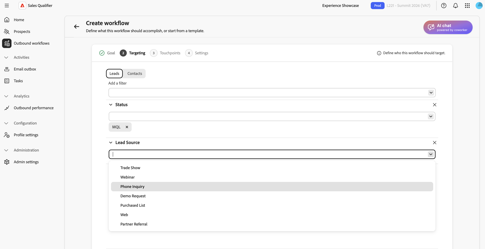
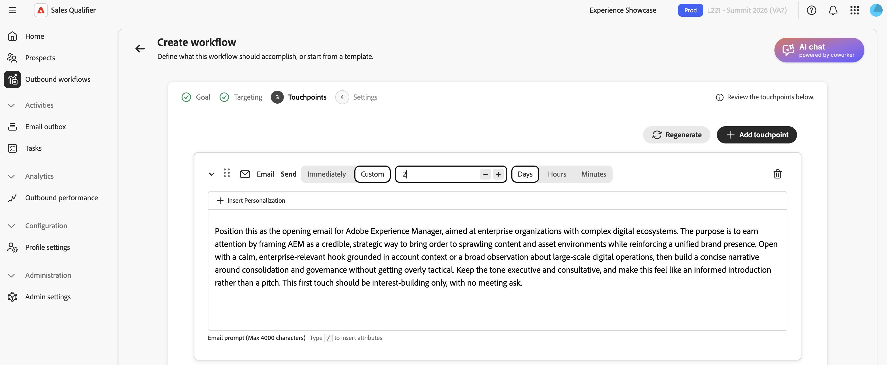
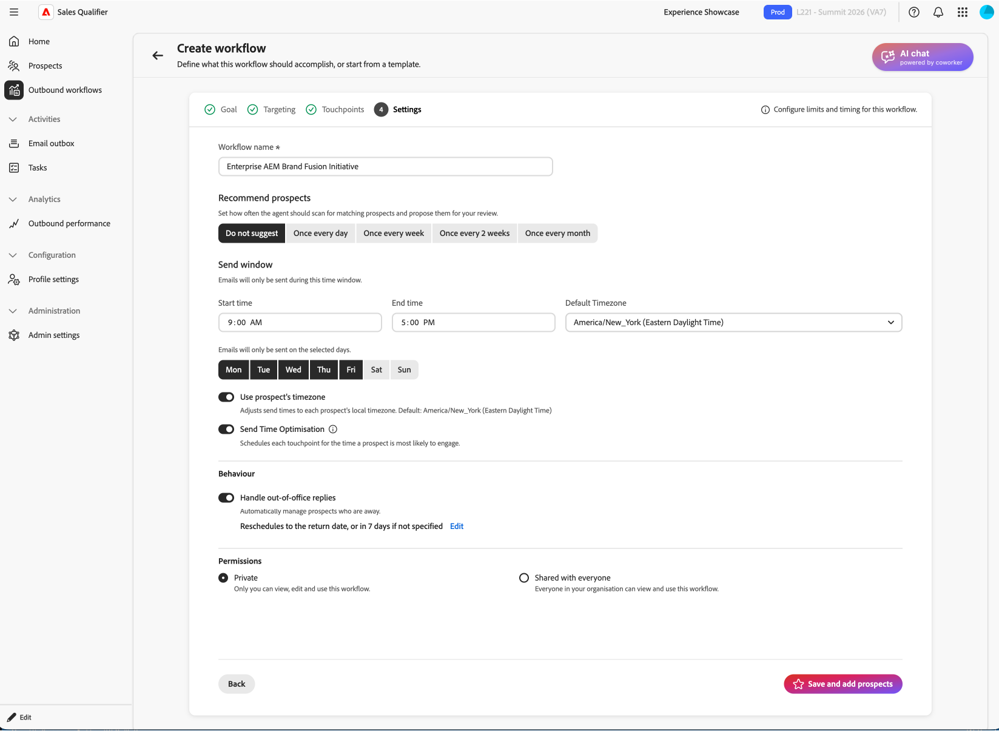

# Ausgehende Workflows

Ein ausgehender Workflow ist eine zielgesteuerte Outreach-Kadenz. Definieren Sie die Zielgruppen- und Zielgruppenkriterien. KI schlägt dann eine Multi-Touch-Kadenz vor und schreibt für jeden Interessenten personalisierten E-Mail-Inhalt. Bevor Sie die Kadenz aktivieren, überprüfen und genehmigen Sie jede E-Mail.

Ein ausgehender Workflow verbindet vier Elemente:

* **Ziel** - Das Ergebnis, das Sie aus der Reichweite ziehen möchten, z. B. die Buchung eines Discovery-Aufrufs oder die Erhöhung der Ereignisregistrierung.
* **Zielgruppenfilter** - Bedingungen, die bestimmen, welche potenziellen Kunden infrage kommen.
* **Touchpoint-**: Die geordnete Sequenz von E-Mail-, Telefonanruf- und LinkedInMail-Schritten.
* **Personalisierter E-**-Inhalt: KI-generierte Inhalte basierend auf dem Interessentenprofil, dem Kontokontext, dem Interaktionsverlauf und den neuesten Nachrichten.

Die KI verwendet das Ziel, Zielgruppenfilter vorzuschlagen, die Kadenz zu entwerfen, Touchpoint-Eingabeaufforderungen zu entwerfen und jede generierte E-Mail zu personalisieren.

## Schlüsselkonzepte

| Konzept | Beschreibung |
| --- | --- |
| **Ausgehender Workflow** | Eine wiederverwendbare ausgehende Aktivität, die durch ein Ziel, Zielgruppenbestimmungsfilter, Kadenz und Einstellungen definiert ist. |
| **Ziel** | Was die Öffentlichkeitsarbeit leisten sollte. |
| **Touchpoint** | Ein Schritt in der Kadenz (E-Mail, Telefonanruf oder LinkedInMail), geplant relativ zur Registrierung. |
| **Touchpoint-Eingabeaufforderung** | Anweisungen, die die KI beim Generieren einer E-Mail-Betreffzeile und eines Textkörpers für einen Interessenten befolgt, einschließlich Ton, Länge, Fokus und call to action. |
| **Kadenz** | Die vollständige Sequenz von Touchpoints: wie viele, in welcher Reihenfolge und an welchen Tagen. |
| **Zielgruppenbestimmungsfilter** | Eine Bedingung, die den ausgehenden Workflow auf eine Untergruppe von potenziellen Kunden beschränkt. |
| **Entwurf** | Eine generierte E-Mail, die zur Überprüfung bereit, aber noch nicht genehmigt ist. |
| **Argumentation** | Die Erklärung der KI, wie sie eine bestimmte E-Mail geschrieben hat, einschließlich der verwendeten Signale und Datenquellen. |
| **Enrollment** | Entwürfe eines Interessenten validieren , wodurch die Kadenz und die Warteschlangen der E-Mails aktiviert werden, die im Versandfenster des ausgehenden Workflows gesendet werden sollen. |

In den folgenden Abschnitten wird beschrieben, wie Sie einen ausgehenden Workflow erstellen, generierte E-Mails überprüfen, Interessenten genehmigen und ausgehende Workflows verwalten.

## Ausgehenden Workflow erstellen

Der Assistent für ausgehende Workflows umfasst fünf Schritte: **[!UICONTROL Ziel]**, **[!UICONTROL Targeting]**, **[!UICONTROL Touchpoints generieren]**, **[!UICONTROL Einstellungen]** und **[!UICONTROL Interessenten hinzufügen]**. Ihr Ziel formt die verbleibenden Schritte.

1. Wählen Sie in der linken Navigation **[!UICONTROL Ausgehende Workflows]** aus.
1. Wählen Sie auf **[!UICONTROL Registerkarte]** Durchsuchen“ **[!UICONTROL + Ausgehenden Workflow erstellen]** in der oberen rechten Ecke aus.

### Schritt 1: Definieren Sie Ihr Ziel

Das Ziel definiert das beabsichtigte Ergebnis und leitet Targeting, Kadenz und E-Mail-Generierung an.

1. Wählen Sie **[!UICONTROL Von Grund auf]**, um Ihr eigenes Ziel zu schreiben, oder wählen Sie **[!UICONTROL Von Vorlage starten]**, um eine gespeicherte Vorlage zu verwenden.

1. Wählen Sie eines der **[!UICONTROL empfohlenen Ziele]** das Ihrem Unternehmen entspricht. Jede Empfehlung enthält eine kurze Erklärung, warum sie passt. Wählen Sie eine Empfehlung aus, um das Ziel auszufüllen, wählen Sie **[!UICONTROL Alle anzeigen]** aus, um alle Empfehlungen zu durchsuchen, oder geben Sie Ihr eigenes Ziel ein. Sie können auch aus der Liste **[!UICONTROL Beliebte Ziele]** auswählen.
1. Wählen Sie **[!UICONTROL Weiter: Zielgruppenbestimmung]**.

Geben Sie ein spezifisches Ergebnis im Ziel an. Geben Sie beispielsweise `Book a 15-minute discovery call with marketing leaders evaluating campaign automation` anstelle von `Promote campaign automation` ein.

### Schritt 2: Zielgruppenbestimmungsfilter konfigurieren

Zielgruppenbestimmungsfilter definieren, welche potenziellen Kunden infrage kommen. Wenn Sie später Interessenten hinzufügen, werden nur die Interessenten in der Auswahlliste angezeigt, die diesen Filtern entsprechen.

{width="800" zoomable="yes"}

1. Wählen Sie den Abwärtspfeil aus, um die Liste **[!UICONTROL Filter hinzufügen]** zu öffnen, und wählen Sie dann einen Filter aus.

1. Legen Sie Werte für den Filter fest.
1. Fügen Sie weitere Filter hinzu, wenn Sie die Zielgruppe eingrenzen möchten.

1. Wählen Sie **[!UICONTROL Weiter: Touchpoints generieren]**.

### Schritt 3: Erstellen und Überprüfen von Touchpoints

Nach der Konfiguration analysiert die KI das Ziel und die Kriterien für die Zielgruppenbestimmung, definiert die Kadenz und gibt für jeden Touchpoint eine Eingabeaufforderung aus. Die Kadenz kann E-Mail-, Telefonanruf- und LinkedInMail-Schritte umfassen.

{width="800" zoomable="yes"}

Erweitern Sie einen E-Mail-Touchpoint, um die Eingabeaufforderung zu lesen. Die Eingabeaufforderung leitet die KI beim Schreiben der E-Mails jedes Interessenten, einschließlich Ton, Länge, Fokus und call to action.

Durch die Eingabe eines Schrägstrichs `/` die Liste der definierten Token angezeigt, die Sie zur Personalisierung der E-Mail verwenden können.

#### Kadenz neu erzeugen

Wenn die Kadenz nicht das ist, was Sie möchten, wählen Sie **[!UICONTROL Regenerieren]** und geben Sie eine Verfeinerungsanweisung ein. Beispiel:

* `Use three touchpoints across two weeks`
* `Lead with an executive briefing offer in the first email`
* `Add a nurture touch focused on a relevant case study`

KI schreibt die gesamte Kadenz auf Grundlage Ihrer Anweisungen um. Um einen E-Mail-Touchpoint anzupassen, bearbeiten Sie seine Eingabeaufforderung, anstatt die gesamte Kadenz neu zu generieren.

Festlegen einer Touchpoint-Verzögerung in Tagen, Stunden und Minuten. Legen Sie die Tage, Stunden und Minuten fest, die nach der Registrierung oder dem Abschluss des vorherigen Touchpoints ohne Wartezeit an den Touchpoint `0` werden sollen. Verwenden Sie eine längere Verzögerung, um später Touchpoints innerhalb der Kadenz zu platzieren.

#### Wissenszentrum in Eingabeaufforderungen verwenden

Wenn Ihr Unternehmen ein Playbook für [Wissenscenter](admin-settings.md#knowledge-center) erstellt hat, verweisen Sie in der Eingabeaufforderung darauf. Benennen Sie das Dokument und beschreiben Sie den zu verwendenden Kontext. Geben Sie beispielsweise `Use the ABC positioning guide from the Knowledge Center and focus on the security value proposition` ein.

Wenn die Kadenz und die Eingabeaufforderungen fertig sind, wählen Sie **[!UICONTROL Weiter: Einstellungen]**.

Verfeinern Sie die Touchpoint-Eingabeaufforderungen vor dem Generieren von E-Mails potenzieller Kundinnen und Kunden. KI verwendet diese Eingabeaufforderungen für jeden ausgewählten Interessenten.

### Schritt 4: Einstellungen für ausgehende Workflows konfigurieren

Der **[!UICONTROL Einstellungen]** steuert, wie der ausgehende Workflow ausgeführt wird.

{width="800" zoomable="yes"}

1. Überprüfen Sie den **[!UICONTROL Namen des ausgehenden Workflows]** und ändern Sie ihn bei Bedarf.
1. Bestätigen **[!UICONTROL unter „Max. potenzielle Kunden pro]**-Workflow“ die maximale Anzahl potenzieller Kunden, die der ausgehende Workflow gleichzeitig verwalten kann.
1. Legen Sie das **[!UICONTROL Sendefenster]** für die Stunden fest, die ausgehende E-Mails senden dürfen.
1. Wählen Sie die Wochentage aus, an denen E-Mails gesendet werden können. Um Wochenendsendungen zu vermeiden, wählen Sie nur die Wochentage aus anstatt eine separate Einstellung **[!UICONTROL Wochenende überspringen]** zu verwenden.
1. Wählen Sie aus, ob der Versand während der aktivsten Stunden jedes Interessenten durchgeführt werden soll.
1. Um Follow-up-Touchpoints automatisch zu stoppen, sobald ein Interessent ein Meeting bucht, aktivieren Sie **[!UICONTROL Meeting-Buchungspause]**.
1. Wählen Sie aus, ob die Zeitzone jedes Interessenten oder der ausgehende Workflow (Zeitzone **[!UICONTROL für]** Versandzeitpunkt verwendet werden soll. Wenn Sie die Zeitzone des ausgehenden Workflows verwenden, vergewissern Sie sich, dass sie mit Ihrer Audience übereinstimmt.
1. Behalten **[!UICONTROL unter]** die Option **[!UICONTROL Privat]** (Standard) bei oder wählen Sie **[!UICONTROL Für alle freigegeben]**. Weitere Informationen finden Sie unter [Freigeben eines ausgehenden Workflows](#share-an-outbound-workflow).
1. Wählen Sie **[!UICONTROL Speichern und Interessenten hinzufügen]** aus.

Die Opt-out-Fußzeile wird global von einem Administrator konfiguriert und gilt unabhängig von den Einstellungen des ausgehenden Workflows für ausgehende E-Mails. Siehe [Konfigurieren einer globalen E-Mail-Abmeldung](integrations.md#configure-global-email-opt-out).

### Schritt 5: Interessenten hinzufügen und E-Mail-Generierung starten

Beim Speichern wird die Perspektivauswahl-Ansicht mit angewendeten Targeting-Filtern aus Schritt 2 geöffnet.

1. Überprüfen Sie die Liste.

   Die Zeilen enthalten normalerweise den Namen des Interessenten, das Konto, die E-Mail-Adresse, die Stellenbezeichnung, den Interaktionsstatus und den Status des Interessenten.

1. Filter hier anpassen, wenn Sie die Liste erweitern oder eingrenzen müssen.
1. Wählen Sie Interessenten mithilfe der Kontrollkästchen aus.
1. Wählen Sie **[!UICONTROL Weiter: Touchpoints überprüfen]**, um mit der Erstellung pro Interessent zu beginnen.

KI generiert eine personalisierte E-Mail für jeden ausgewählten Interessenten und E-Mail-Touchpoint. Telefon- und LinkedInMail-Touchpoints bleiben geplante Schritte. Um während der Generierung weiter zu arbeiten, wählen Sie **[!UICONTROL Bei Fertigstellung benachrichtigen]**.

Für jeden Interessenten kombiniert die KI die Touchpoint-Eingabeaufforderung mit Personen- und Account-Daten, dem Interaktionsverlauf und den neuesten Nachrichten, um eine Betreffzeile und einen Text zu erstellen.

## Überprüfen und Verfeinern generierter E-Mails

Nach Abschluss der Generierung werden Sie in der Detailansicht des ausgehenden Workflows aufgefordert, die Entwürfe zu überprüfen. Sales Qualifier sendet erst dann eine E-Mail, wenn Sie sie genehmigt haben.

1. Wählen Sie in der Detailansicht „Ausgehender Workflow **[!UICONTROL im Banner die Option]** Entwürfe überprüfen“ aus.
1. Der Schritt **[!UICONTROL Touchpoints überprüfen]** umfasst zwei Registerkarten:
   * **[!UICONTROL Bereit für Überprüfung]** - E-Mails, deren Generierung abgeschlossen ist.
   * **[!UICONTROL Generating]** - E-Mails, die noch geschrieben werden.
1. Wählen Sie links in der Liste potenzieller Kunden einen Namen aus, um die Kontaktpunkte dieses potenziellen Kunden rechts zu laden.
1. Verwenden Sie den Pfeil (**>**) auf einem Touchpoint, um die gesamte Betreffzeile und den gesamten Textkörper zu erweitern und zu lesen.

### Lesen der KI-Argumentation

Für jede generierte E **[!UICONTROL Mail wird in &quot;]**&quot; erläutert, wie die KI diese Nachricht erstellt hat, einschließlich Signalen, Attributen und Quellen, die den Inhalt und call to action geprägt haben. Überprüfen Sie diese Informationen und validieren Sie die Personalisierung, bevor Sie sie genehmigen.

### E-Mails direkt bearbeiten

Für kleine Formulierungen oder Tonänderungen:

1. Wählen Sie auf dem erweiterten Touchpoint das Symbol **[!UICONTROL Bearbeiten]** aus, um den Editor zu öffnen.
1. Bearbeiten Sie die Betreffzeile oder den Text.
1. Wählen Sie **[!UICONTROL Speichern]** aus.

### E-Mails mit KI verfeinern

Verwenden Sie für strukturelle Änderungen oder Hervorhebungsänderungen **[!UICONTROL Mit KI generieren]**. KI schreibt die E-Mail neu und behält dabei ihren Personalisierungskontext bei.

1. Wählen Sie im E-Mail-Editor **[!UICONTROL Mit KI generieren]** aus.

1. Geben Sie eine klare Anweisung ein, z. B.:
   * `Make it shorter and more direct. Keep it under 100 words.`
   * `Focus more on the prospect's role and how the solution helps them specifically.`
   * `Change the call-to-action to suggest a 15-minute introductory call instead.`
1. Überprüfen Sie die Revision und bearbeiten Sie sie bei Bedarf.
1. Wählen Sie **[!UICONTROL Speichern]** aus.

>[!TIP]
>
>Verwenden Sie direkte Bearbeitungen für Formulierungs- und Tonänderungen. Verwenden Sie **[!UICONTROL Mit KI generieren]** um die E-Mail neu zu schreiben.

## Interessenten genehmigen und registrieren

Validierung aktiviert die Kadenz für einen Interessenten. Das System sendet erst dann E-Mails an einen Interessenten, wenn Sie diese validieren und registrieren.

1. Wählen Sie in der linken Liste die Interessenten aus, deren E-Mails Sie geprüft haben und senden möchten.
1. Wählen **[!UICONTROL Interessenten genehmigen und registrieren]** in der rechten unteren Ecke aus.

Genehmigte E-Mails werden entsprechend den ausgewählten Tagen des ausgehenden Workflows, dem Sendefenster, der Option „Aktive Stunden“ und der Zeitzoneneinstellung gesendet. Ein Touchpoint mit einer Verzögerung von null sendet ohne Wartezeit. Jeder andere Touchpoint folgt seiner konfigurierten Verzögerung. Nicht genehmigte Interessenten verbleiben in **[!UICONTROL Bereit für Überprüfung]**.

## Freigeben eines ausgehenden Workflows

Jeder ausgehende Workflow verfügt über eine **[!UICONTROL Berechtigungen]**. Ausgehende Workflows sind **[!UICONTROL privat]**. Der Verantwortliche kann **[!UICONTROL Für alle freigegeben]** auswählen, um einen ausgehenden Workflow für das Team verfügbar zu machen.

>[!CAUTION]
>
>Die Freigabe ist dauerhaft. Nachdem ein ausgehender Workflow auf „Für alle freigegeben **[!UICONTROL festgelegt wurde]** kann er nicht mehr in &quot;**[!UICONTROL &quot;]** werden.

In einem gemeinsamen ausgehenden Workflow können sich Teammitglieder für ihre eigenen potenziellen Kunden registrieren. Jede Person kann nur die Interessenten verwalten oder pausieren, die sie registriert hat, auch bei der Verwendung von Massenaktionen. Der Eigentümer des ausgehenden Workflows kann die Einstellungen auf Planebene, einschließlich Zeitplan, Zeitzone, Kadenz und anderer Einstellungen, allein bearbeiten. Diese Einstellungen sind für Teammitglieder schreibgeschützt.

Verwenden Sie diese Filter, um freigegebene ausgehende Workflows und Ergebnisse fokussiert zu halten:

* Verwenden Sie **[!UICONTROL Engagierte Interessenten]** und **[!UICONTROL Leistung]** die Option **[!UICONTROL Registriert von]**, um Interessenten nach der Person zu filtern, die sie registriert hat. Der Filter bezieht sich standardmäßig auf die von Ihnen registrierten potenziellen Kunden.
* Verwenden Sie auf der Registerkarte **[!UICONTROL Durchsuchen]** den Freigabefilter, um **[!UICONTROL Von mir]**, **[!UICONTROL Für mich freigegeben]**, **[!UICONTROL Privat]** oder **[!UICONTROL Alle]** auszuwählen.

## Bearbeitung von Abwesenheitsanfragen

Wenn ein Interessent mit einer Abwesenheitsnachricht antwortet, wird diese automatisch vom ausgehenden Workflow verarbeitet.

* **Automatische Wiederaufnahme**: Standardmäßig aktiviert. Wenn die Abwesenheitsantwort ein Rückgabedatum enthält, setzt der ausgehende Workflow die Kadenz an diesem Datum fort. Wenn kein Rückgabedatum angegeben wird, wird der ausgehende Workflow nach einem Puffer für die Wiederaufnahme nach fortgesetzt, den Ihr Team konfigurieren kann.
* **Manuelle Optionen**: Ein Vertriebsmitarbeiter kann weiterhin „Jetzt **[!UICONTROL &quot;]** oder ein bestimmtes Wiederaufnahmedatum planen. Siehe [Verwalten vorhandener ausgehender Workflows](#manage-existing-outbound-workflows).

## Verwalten vorhandener ausgehender Workflows

Auf der Seite **[!UICONTROL Ausgehende Workflows]** werden auf der Registerkarte **[!UICONTROL Durchsuchen]** alle ausgehenden Workflows aufgelistet, die für Sie verfügbar sind. Jede Karte zeigt das Ziel, konfigurierte Touchpoints und Leistungsmetriken. Verwenden Sie diese Ansicht, um ausgehende Workflows zu überwachen, Entwürfe zu überprüfen oder Interessenten hinzuzufügen.

## E-Mail-Postausgang

Im [E-Mail-Postausgang](email-outbox.md) werden die in Ihrem Namen gesendeten automatisierten E-Mails und etwaige Antworten aufgelistet.

## Buchung eines Meetings

Wenn Sie Ihren Kalender verbinden, generiert Sales Qualifier einen persönlichen Buchungslink, über den Interessenten Zeit mit Ihnen planen können.

* **Buchungslinks** - Konfigurieren Sie Ihre Kalenderverbindung und -verfügbarkeit in [Profileinstellungen](profile-settings.md). Fügen Sie den Buchungs-Link zu Ihrer E-Mail-Signatur hinzu, damit sie in ausgehenden E-Mails angezeigt wird.
* **Kadenzplatzierung** - Sales Qualifier fügt Ihren Buchungslink an relevanten Stellen in einer Kadenz ein. Sie können die Platzierung ändern.
* **Buchungspause**: Wenn ein potenzieller Kunde ein Meeting bucht, **[!UICONTROL Buchungspause für das Meeting]** werden keine weiteren Folgemaßnahmen mehr durchgeführt. Siehe [Schritt 4: Einstellungen für ausgehende Workflows konfigurieren](#step-4-configure-outbound-workflow-settings).

Tracking von Buchungsergebnissen auf der Seite [Ausgehende Leistung](performance.md).

## Best Practices für ausgehende Workflows

* **Definieren eines bestimmten Ziels.** Zielgruppenbestimmung, Kadenz und E-Mails werden alle vom Ziel abgeleitet. Geben Sie das Ergebnis an, das der ausgehende Workflow erreichen soll.
* **Touchpoint-Eingabeaufforderungen vor der Generierung pro Interessent abschließen.** Nach der Massengenerierung werden Änderungen normalerweise jeweils nur von einem Interessenten vorgenommen.
* **Verwenden von Argumentation als Qualitätsprüfung.** Wenn das falsche Signal hervorgehoben wird oder ein relevantes Signal fehlt, bearbeiten Sie die E-Mail oder überarbeiten Sie die Touchpoint-Eingabeaufforderung und regenerieren Sie die Kadenz.
* **Passen Sie das Bearbeitungswerkzeug an die Änderung an.** Verwenden Sie direkte Bearbeitungen für Text und Ton. Verwenden Sie **[!UICONTROL Mit KI generieren]** für die Neustrukturierung oder das Reframing.
* **Genehmigen Sie nur, was Sie geprüft haben.** Erweitern Sie Touchpoints, lesen Sie den Inhalt und verfeinern Sie ihn vor der Registrierung nach Bedarf.

>[!MORELIKETHIS]
>
>* [Aufgaben](tasks.md)
>* [Wissenszentrum](admin-settings.md#knowledge-center)
>* [Ausgehende Leistung](performance.md)
