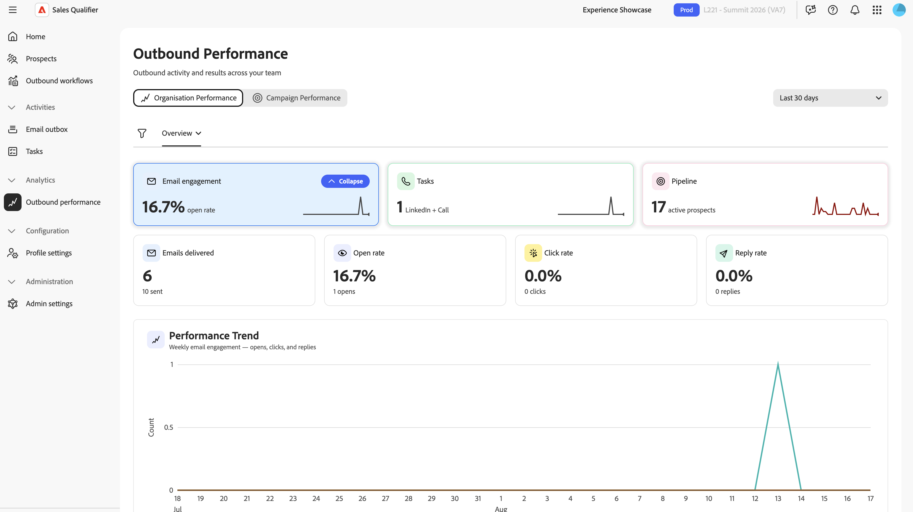

# Ausgehende Leistung im Adobe Marketo Qualifier

Wählen Sie im linken Navigationsbereich die Option **[!UICONTROL Ausgehende Leistung]** aus, um die ausgehende Aktivität und die Ergebnisse in Ihrem gesamten Team zu verfolgen. Das Dashboard hat zwei Ansichten: **[!UICONTROL Organisationsleistung]** und **[!UICONTROL Kampagnenleistung]**.

{width="800" zoomable="yes"}

## Filter und Zeitraum

Diese Steuerelemente gelten für alle Ansichten und Registerkarten:

* **[!UICONTROL Filter]**: Wählen Sie **[!UICONTROL Filter]** aus, um das Dashboard nach Teammitglied und Kampagne einzugrenzen.
* **[!UICONTROL Zeitraum]**: Wählen Sie ein Reporting-Fenster von 7, 15, 30, 60, 90, 180 oder 365 Tagen aus.

## Organisationsleistung

**[!UICONTROL Organisationsleistung]** Berichte über ausgehende Aktivitäten und Ergebnisse im gesamten Team. Es gibt drei Registerkarten: **[!UICONTROL Übersicht]**, **[!UICONTROL E-]** und **[!UICONTROL Aufgaben]**.

### Registerkarte „Überblick“

Die Registerkarte **[!UICONTROL Übersicht]** fasst die ausgehenden Ergebnisse zusammen. Klicken Sie auf eines der Felder, um das Diagramm mit diesen Informationen anzuzeigen.

* **Kacheln**: Pipeline, E-Mail-Interaktion und manuelle Aktivität, jeweils mit einer Trendänderung im Vergleich zum vorherigen Zeitraum.
* **Performance-Trenddiagramm**: Ausgehende Performance über den ausgewählten Zeitraum.
* **[!UICONTROL Team-Aktivität]** Tabelle: Nach Vertreter kategorisierte Aktivität.
* **Interessenten insgesamt**: Die Gesamtzahl der Interessenten, nicht nur der aktiven, sodass das gesamte ausgehende Volumen nicht unterzählt wird.

### Registerkarte „E-Mails“

Die Registerkarte **[!UICONTROL E]** Mails) enthält Berichte zum E-Mail-Volumen und zur Effektivität:

* **Kacheln**: Öffnungsrate und Klickrate, standardmäßig angezeigt, sodass die Leistung über Kampagnen mit unterschiedlichem Volumen hinweg vergleichbar ist. Wählen Sie stattdessen den Umschalter aus, um die Rohanzahl der gesendeten, geöffneten, angeklickten und geantworteten E-Mails anzuzeigen.
* **Trenddiagramm für die wöchentliche E-Mail**: E-Mail-Aktivität nach Woche.
* Tabelle der E-Mail-Leistung pro Vertreter

Der Marketo-Qualifizierer weist Abwesenheitsantworten und Bounces separate Status zu, damit Sie sie von Interessenteninteraktionen unterscheiden können.

### Registerkarte „Aufgaben“

Die Registerkarte **[!UICONTROL Aufgaben]** enthält Berichte zur manuellen Kontaktaufnahme:

* **Kacheln**: Telefonanruf und Abschluss von LinkedIn-Nachrichten, einschließlich Abschlussrate.
* **Trend-Diagramm**: Aufgabenabschluss über den ausgewählten Zeitraum.
* Tabelle der repräsentativen Aufgaben.

## Kampagnenleistung

**[!UICONTROL Kampagnenleistung]** Berichte über ausgehende Ergebnisse nach ausgehenden Workflow-Kampagnen:

* **KPI-Kacheln**: Aktive Interessenten, Öffnungsrate, Klickrate, Antwortrate und gebuchte Meetings. Das System zeigt standardmäßig die Öffnungs- und Klickrate an, sodass die Leistung in allen Kampagnen mit unterschiedlichem Volumen vergleichbar ist. Wählen Sie stattdessen den Umschalter aus, um die Rohzahlen anzuzeigen.
* **Diagramm zur Entwicklung der Kampagnenmetriken**: Kampagnen-KPIs über den ausgewählten Zeitraum.
* **[!UICONTROL Kampagnen]** Tabelle: E-Mail-, Meeting-, Aufruf- und LinkedIn-Nachrichtenaktivität für jede Kampagne. Um Details auf repräsentativer Ebene für eine Kampagne anzuzeigen, erweitern Sie deren Zeile.

Informationen [ Generierung von Buchungen ](outbound-workflows.md#meeting-booking) Sie unter „Besprechungsbuchung“.

>[!MORELIKETHIS]
>
>* [Ausgehende Workflows](outbound-workflows.md)
>* [Aufgaben](tasks.md)
