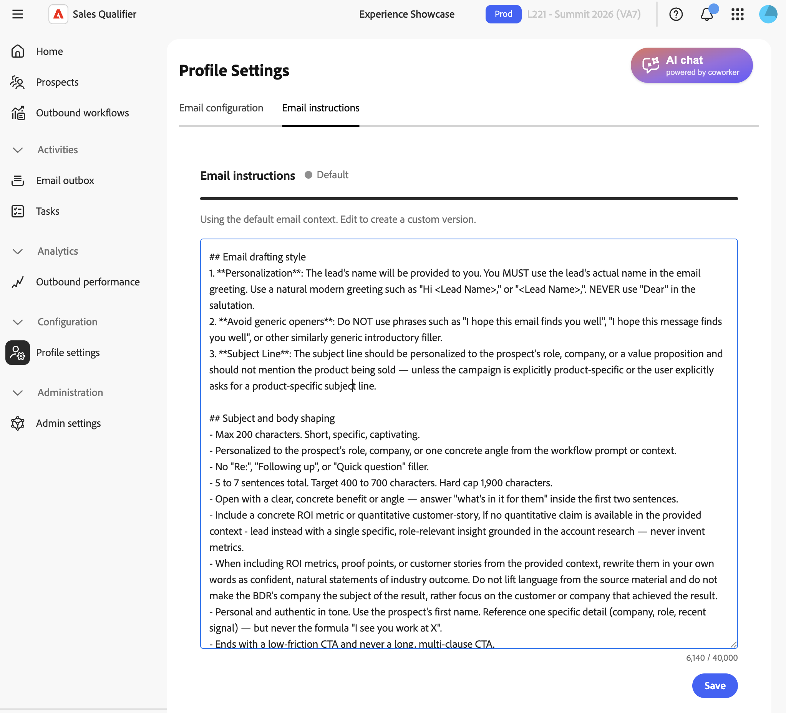
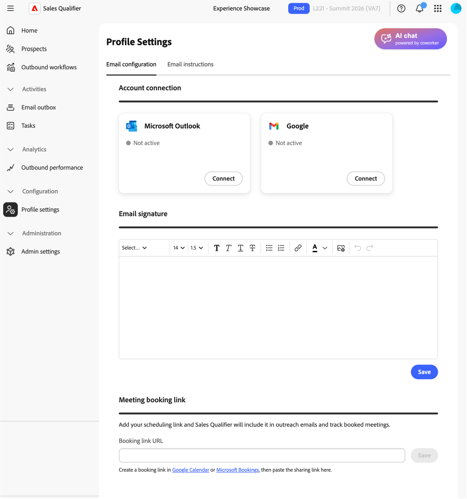

# Profileinstellungen

Erweitern Sie in der linken Navigation **[!UICONTROL Konfiguration]** und wählen Sie **[!UICONTROL Profileinstellungen]** aus. Verwenden Sie diese Einstellungen, um Ihre persönlichen Daten, E-Mail-Verbindung, Kalender und Chat-Verfügbarkeit zu verwalten.

## E-Mail-Einstellungen

Richten Sie auf **[!UICONTROL Registerkarte]** E-Mail-Einstellungen“ Ihre E-Mail-Verbindungen ein.

* **[!UICONTROL E-Mail-Verbindungen]** - Wählen Sie Microsoft Outlook oder Google aus und folgen Sie dem Anmeldevorgang. Unter [Outlook verbinden](integrations.md#connect-outlook) finden Sie den von Ihnen genehmigten Zugriff und ggf. den Genehmigungspfad des Administrators.
* **[!UICONTROL E-Mail-Signatur]** - Fügen Sie die in generierten E-Mails verwendete Signatur hinzu oder aktualisieren Sie sie. Fügen Sie Ihren [Meeting-Buchungs](outbound-workflows.md#meeting-booking)-Link ein, damit potenzielle Kunden Zeit mit Ihnen planen können.
* **[!UICONTROL Meeting-Buchungslink]** - Senden Sie eine Besprechungseinladung in Ihre E-Mails. Verwendet die Besprechungs-URL.

### E-Mail-Zeichnungskontext

Verwenden Sie **[!UICONTROL E-Mail]** Zeichnungskontext, um den E-Mail-Ton, die Struktur und den Stil festzulegen, sodass E-Mails konsistent sind.

Schreiben Sie Ihren Kontext im Bereich **[!UICONTROL E-Mail-Zeichnungskontext]** als Markdown.
Damit können Sie Folgendes definieren:

* Ton und Stimme
* Struktur und Länge
* Personalization und Grußregeln
* Betreffzeilenstil
* Verwendung von Interaktionssignalen
* So werden Metriken, Korrekturpunkte und Kundengeschichten dargestellt

Standardmäßig verwenden Entwürfe einen Kontext im Hausstil, sodass sich Ihre vorhandenen Entwürfe erst ändern, wenn Sie Ihren eigenen Kontext hinzufügen.

## Kalenderkonfiguration

Legen Sie auf **[!UICONTROL Registerkarte]** Kalenderkonfiguration“ Ihre Zeitzone und Verfügbarkeit fest.

* **[!UICONTROL Kalenderverbindung]** - Wählen Sie **[!UICONTROL Verbinden]** und folgen Sie dem Microsoft-Anmeldeprozess.
* **[!UICONTROL E-Mail zur Besprechungsbestätigung]** - Definieren Sie den Betreff und Text der Bestätigungs-E-Mail, die ein Interessent nach der Buchung eines Meetings erhält.
* **[!UICONTROL Voreinstellungen]** - Legt die standardmäßige Länge der Besprechung und den Puffer zwischen den Besprechungen fest.

Wenn Sie den Kalender trennen:

* Aktive Buchungslinks funktionieren nicht mehr.
* Auf der Buchungsseite wird eine Meldung über die vorübergehende Nichtverfügbarkeit angezeigt.
* Ihre Einstellungen bleiben beim erneuten Herstellen der Verbindung erhalten.

## Kalenderverfügbarkeit

Die Kalenderverfügbarkeit in Sales Qualifier basiert auf zwei Eingaben:

* Ihr verbundener Arbeitskalender, z. B. Outlook oder Gmail
* Die Verfügbarkeits- und Zeitschlitzregeln in **[!UICONTROL Kalenderkonfiguration]**

Sales Qualifier liest den Frei/Belegt-Status, nicht die Ereignisdetails, aus dem verbundenen Kalender. Er kombiniert diesen Status mit Ihren Regeln, um die Zeitfenster zu bestimmen, die potenzielle Kunden buchen können.

Sie können Folgendes konfigurieren:

* Arbeitszeit nach Wochentag
* Mehrere Blöcke pro Tag, z. B. 9:00 Uhr bis 13:00 Uhr bis 17:00 Uhr.
* Ihre Zeitzone
* Meeting-Dauer
* Puffer vor und nach Besprechungen
* Mindestkündigungsfrist
* Buchungsfenster

>[!MORELIKETHIS]
>
>* [Ausgehende Workflows](outbound-workflows.md)
>* [Integrationen](integrations.md)
>* [Aufgaben](tasks.md)
