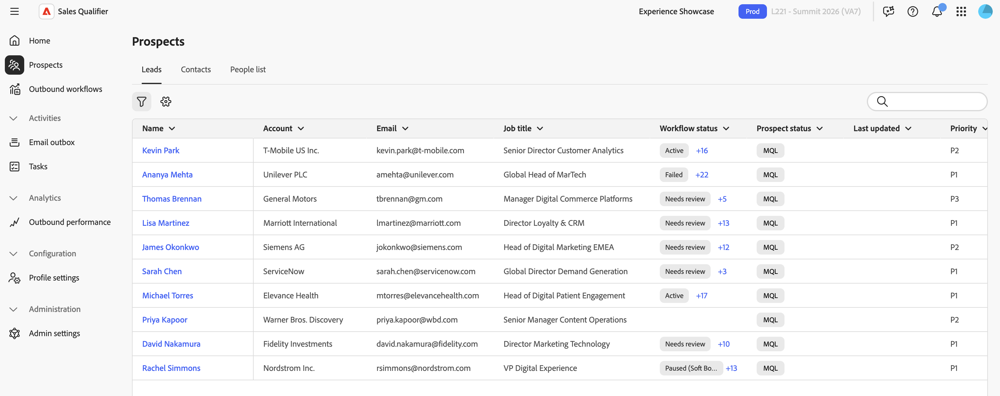

# Prospects

Wählen **[!UICONTROL Interessenten]** in der linken Navigationsleiste aus, um die Leads und Kontakte anzuzeigen, auf die Sie zugreifen können. In der Liste können Sie den Status und die letzte Aktivität jedes Interessenten überprüfen.

{width="800" zoomable="yes"}

* **[!UICONTROL Leads]** - Leads, die Ihnen im verbundenen CRM zugewiesen sind.
* **[!UICONTROL Kontakte]** - Kontakte, die Ihnen im verbundenen CRM zugewiesen sind.
* **[!UICONTROL Personenliste]** - Interessenten, die Sie manuell importieren oder hinzufügen.

## Interessentenliste erstellen

In der Liste potenzieller Kunden werden Personen aus mehreren Quellen zusammengefasst:

* **CRM-Interessenten** - Sales Qualifier importiert automatisch Leads und Kontakte, die dem verbundenen Benutzer zugewiesen sind. Siehe [Integrationen](integrations.md).
* **Importierte Interessenten** - Aus einer CSV-Datei importierte Interessenten.
* **Manuell hinzugefügte Interessenten** - Individuelle Interessenten in Sales Qualifier hinzugefügt.

So fügen Sie potenzielle Kunden hinzu, die nicht aus Ihrem CRM stammen:

1. Wählen Sie auf **[!UICONTROL Seite]** Interessenten“ die Option **[!UICONTROL Personenliste]** aus.
1. Wählen Sie **[!UICONTROL + Personen hinzufügen]** dann **[!UICONTROL CSV importieren]** oder **[!UICONTROL Person hinzufügen]**.

   * Laden Sie für einen CSV-Import eine CSV-Datei im `firstname,email` Format hoch.
     Vorname und E-Mail sind erforderlich. Der Nachname ist optional. Die CSV-Vorlage enthält nicht die CRM-Lead-ID-Spalte, aber Sie können die Spalte und ihre Werte der Datei vor dem Import hinzufügen. Wenn der Import fehlschlägt, überprüfen Sie die Fehlermeldung hinsichtlich der zu korrigierenden Felder oder Werte und laden Sie die Datei erneut hoch.
   * Um eine Person manuell hinzuzufügen, geben Sie deren Details in das Formular ein.

1. Wählen Sie **[!UICONTROL Speichern]** aus.

## Prospects filtern und suchen

Wählen Sie **[!UICONTROL Filter]** aus, um die Liste einzugrenzen. Sie können nach folgenden Kriterien filtern:

* Status des Interaktionsplans
* Erstellt von
* Stellenbezeichnung
* Konto
* Quelle
* Zuletzt aktualisiert

Administratoren können auch zugeordnete CRM-Felder als Filter verfügbar machen. Aktivieren Sie **[!UICONTROL Admin]** für jedes Feld **[!UICONTROL das]** Filterbar“, das die Kundenbetreuer verwenden, um Interessenten zu finden. Siehe [Zuordnen von CRM-Feldern](integrations.md#map-crm-fields-inbound-mapping).

In **[!UICONTROL Meine Opportunity-Kontakte]** können Sie Kontakte auch nach Feldern aus den zugehörigen Opportunities filtern, wie Stadium, Typ und Abschlussdatum. Opportunity-Felder haben Bezeichnungen wie **[!UICONTROL Phase (Opportunity)]** die sie von Kontaktfeldern unterscheiden. Ihr Administrator steuert, welche Opportunity-Felder als Filter verfügbar sind.

### Nach Marketo-Interaktion filtern

Finden Sie Interessenten und priorisieren Sie sie anhand ihrer Live-[!DNL Marketo]-Interaktion, z. B. Öffnungen und Klicks von E-Mails, Web-Besuche, ausgefüllte Formulare und interessante Momente. Die Interaktion erfolgt praktisch in Echtzeit.

So filtern Sie potenzielle Kunden nach Marketo-Interaktion:

1. Wählen Sie **[!UICONTROL Filter]** aus.
1. Fügen Sie einen [!DNL Marketo] Interaktionsfilter hinzu und legen Sie den Aktivitätstyp, die Kampagne oder andere Attribute fest, um sich auf die Interaktion zu konzentrieren, die von Bedeutung ist.

Jeder Interessent zeigt seine neuesten [!DNL Marketo] Aktivitäten zusammen mit dem aktuellen Verlauf an.

Die Filterung der Marketo-Interaktion ist in allen Produktionsregionen verfügbar. Ihr Administrator aktiviert sie für Ihre Organisation und Sandbox, und ein Marketing-Experte führt eine einmalige Einrichtung in [!DNL Marketo] durch. Siehe [Marketo-Interaktionsfilter aktivieren](integrations.md#turn-on-marketo-engagement-filtering).

## Details des potenziellen Kunden überprüfen

Interessenten auswählen, um ihr Profil zu öffnen. Überprüfen Sie die wichtigen Signale, bevor Sie sich melden:

* **KI-Personenübersicht** - Ein von KI geschriebener Schnappschuss des Leads oder Kontakts und der aktuellen Interaktion. Anhand der Zusammenfassung können Sie sich einen Überblick über die Person verschaffen, bevor Sie einzelne Aktivitäten überprüfen. Personenzusammenfassungen zu KI sind auf Instanzen verfügbar, auf denen Adobe Journey Optimizer B2B edition Prime oder Ultimate ausgeführt wird.
* **Aktivitätsliste** - Eine chronologische Liste der Aktivitäten und des aktuellen Verhaltens.
* **Zeitleisten-Ansicht** - Eine visuelle Zeitleiste der Interaktion über alle Kanäle hinweg.
* **Angezeigte Inhalte** - Web-Seiten und Assets, die der potenzielle Kunde angesehen hat. Element auswählen, um es zu öffnen.

>[!MORELIKETHIS]
>
>* [Konten](accounts.md)
>* [Ausgehende Workflows](outbound-workflows.md)
>* [AI-Chat](ai-assistant.md)
