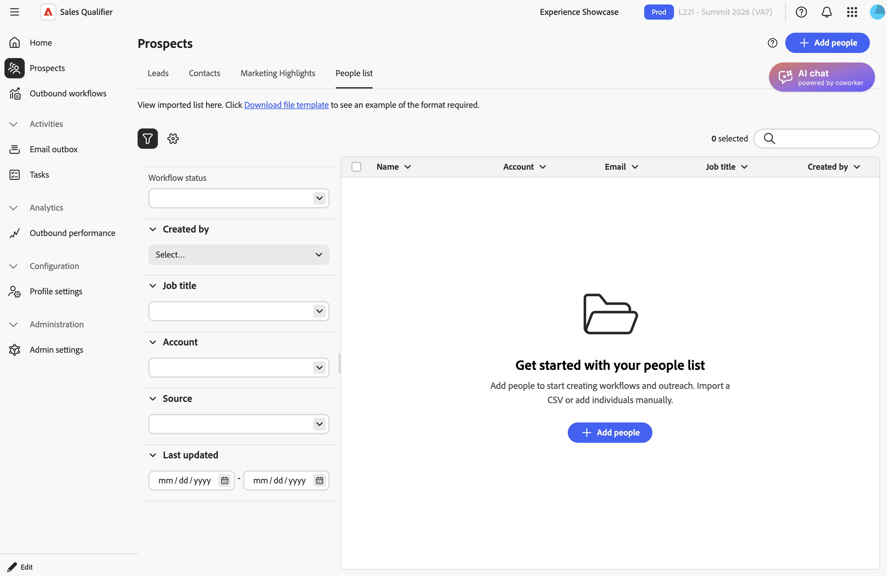

# Prospects

Wählen **[!UICONTROL Interessenten]** in der linken Navigationsleiste aus, um die Leads und Kontakte anzuzeigen, auf die Sie zugreifen können. In der Liste können Sie den Status und die letzte Aktivität jedes Interessenten überprüfen.

{width="800" zoomable="yes"}

* **[!UICONTROL Leads]** - Leads, die Ihnen im verbundenen CRM zugewiesen sind.
* **[!UICONTROL Kontakte]** - Kontakte, die Ihnen im verbundenen CRM zugewiesen sind.
* **[!UICONTROL Marketing-Highlights]** - Interessenten mit Live-Marketo-Aktivitäten wie E-Mail-Öffnungen oder -Klicks.
* **[!UICONTROL Personenliste]** - Interessenten, die Sie manuell importieren oder hinzufügen.

## Interessentenliste erstellen

In der Liste potenzieller Kunden werden Personen aus mehreren Quellen zusammengefasst:

* **CRM-Interessenten** - Adobe Marketo Qualifier importiert automatisch Leads und Kontakte, die dem verbundenen Benutzer zugewiesen sind. Siehe [Integrationen](integrations.md).
* **Importierte Interessenten** - Aus einer CSV-Datei importierte Interessenten.
* **Manuell hinzugefügte Interessenten** - In Marketo Qualifier hinzugefügte einzelne Interessenten.

So fügen Sie potenzielle Kunden hinzu, die nicht aus Ihrem CRM stammen:

1. Wählen Sie auf **[!UICONTROL Seite]** Interessenten“ die Option **[!UICONTROL Personenliste]** aus.

   {width="800" zoomable="yes"}

1. Wählen Sie **[!UICONTROL + Personen hinzufügen]** dann **[!UICONTROL CSV importieren]** oder **[!UICONTROL Person hinzufügen]**.

   * Laden Sie für einen CSV-Import eine CSV-Datei im `firstname,email` Format hoch.
     Vorname und E-Mail sind erforderlich. Der Nachname ist optional. Die CSV-Vorlage enthält nicht die CRM-Lead-ID-Spalte, aber Sie können die Spalte und ihre Werte der Datei vor dem Import hinzufügen. Wenn der Import fehlschlägt, überprüfen Sie die Fehlermeldung hinsichtlich der zu korrigierenden Felder oder Werte und laden Sie die Datei erneut hoch.
     Ordnen Sie alle benutzerdefinierten oder zusätzlichen CSV-Felder zu, nicht nur die standardmäßigen. Der Marketo-Qualifizierer speichert diese Werte für jeden Interessenten und stellt sie später zur Verfügung, auch für die [E-Mail-Generierung](outbound-workflows.md#step-5-add-prospects-and-start-email-generation).
   * Um eine Person manuell hinzuzufügen, geben Sie deren Details in das Formular ein.

1. Wählen Sie **[!UICONTROL Speichern]** aus.

## Prospects filtern und suchen

Wählen Sie **[!UICONTROL Filter]** aus, um die Liste einzugrenzen. Sie können nach folgenden Kriterien filtern:

* Status des ausgehenden Workflows
* Erstellt von
* Stellenbezeichnung
* Konto
* Quelle
* Zuletzt aktualisiert

Administratoren können auch zugeordnete CRM-Felder als Filter verfügbar machen. Aktivieren Sie **[!UICONTROL Admin]** für jedes Feld **[!UICONTROL das]** Filterbar“, das die Kundenbetreuer verwenden, um Interessenten zu finden. Siehe [Zuordnen von CRM-Feldern](integrations.md#map-crm-fields-inbound-mapping).

In **[!UICONTROL Meine Opportunity-Kontakte]** können Sie Kontakte auch nach Feldern aus den zugehörigen Opportunities filtern, wie Stadium, Typ und Abschlussdatum. Opportunity-Felder haben Bezeichnungen wie **[!UICONTROL Phase (Opportunity)]** die sie von Kontaktfeldern unterscheiden. Ihr Administrator steuert, welche Opportunity-Felder als Filter verfügbar sind.

### Nach Marketing-Highlights filtern

Finden Sie Interessenten und priorisieren Sie sie anhand ihrer Live-[!DNL Marketo]-Interaktion, z. B. Öffnungen und Klicks von E-Mails, Web-Besuche, ausgefüllte Formulare und interessante Momente. Die Interaktion erfolgt praktisch in Echtzeit.

So filtern Sie Interessenten nach Marketing-Highlights:

1. Wählen Sie **[!UICONTROL Filter]** aus.
1. Fügen Sie einen Filter Marketing-Highlights hinzu und legen Sie den Aktivitätstyp, die Kampagne oder andere Attribute fest, um sich auf die wichtige Interaktion zu konzentrieren.

Jeder Interessent zeigt seine neuesten [!DNL Marketo] Aktivitäten zusammen mit dem aktuellen Verlauf an.

Marketing-Highlights sind in allen Produktionsregionen verfügbar. Ein Administrator führt eine einmalige Einrichtung durch, die [!DNL Marketo] mit dem Marketo Qualifier verbindet. Siehe [Einrichten von Marketing-](integrations.md#turn-on-marketo-engagement-filtering)&quot;.

## Details des potenziellen Kunden überprüfen

Interessenten auswählen, um ihr Profil zu öffnen. Überprüfen Sie die wichtigen Signale, bevor Sie sich melden:

* **KI-Personenübersicht** - Ein von KI geschriebener Schnappschuss des Leads oder Kontakts und der aktuellen Interaktion. Anhand der Zusammenfassung können Sie sich einen Überblick über die Person verschaffen, bevor Sie einzelne Aktivitäten überprüfen. Personenzusammenfassungen zu KI sind auf Instanzen verfügbar, auf denen Adobe Journey Optimizer B2B edition Prime oder Ultimate ausgeführt wird.
* **Aktivitätsliste** - Eine chronologische Liste der Aktivitäten und des aktuellen Verhaltens.
* **Zeitleisten-Ansicht** - Eine visuelle Zeitleiste der Interaktion über alle Kanäle hinweg.
* **Angezeigte Inhalte** - Web-Seiten und Assets, die der potenzielle Kunde angesehen hat. Element auswählen, um es zu öffnen.

### Vorbereitung für Besprechung generieren

Zusätzlich zur stehenden KI-Personenzusammenfassung können Sie auf der Registerkarte **[!UICONTROL Meeting-Recherche]** neben **[!UICONTROL Account-Recherche]** eine Besprechungsvorbereitung generieren, die auf einen bestimmten bevorstehenden Aufruf zugeschnitten ist.

* **Zielbasiert: Wenn** Interessent in einem laufenden ausgehenden Workflow registriert ist, wählen Sie ihn aus. Die Vorbereitung richtet sich nach dem Ziel dieses ausgehenden Workflows, z. B. der Buchung eines Meetings, einer Produktpräsentation, einer Ereigniseinladung oder der erneuten Interaktion des potenziellen Kunden.
* **Benutzerdefinierte Eingabeaufforderung** Geben Sie ein, worauf Sie sich vorbereiten möchten, z. B. `Focus on renewal risk` oder `Prepare for a technical deep dive with their IT lead`. Die Vorbereitung entspricht Ihrer Eingabeaufforderung. Die benutzerdefinierte Eingabeaufforderungsoption ist immer dann verfügbar, wenn sich der Interessent nicht in einem laufenden ausgehenden Workflow befindet.

>[!MORELIKETHIS]
>
>* [Konten](accounts.md)
>* [Ausgehende Workflows](outbound-workflows.md)
>* [AI-Chat](ai-assistant.md)
