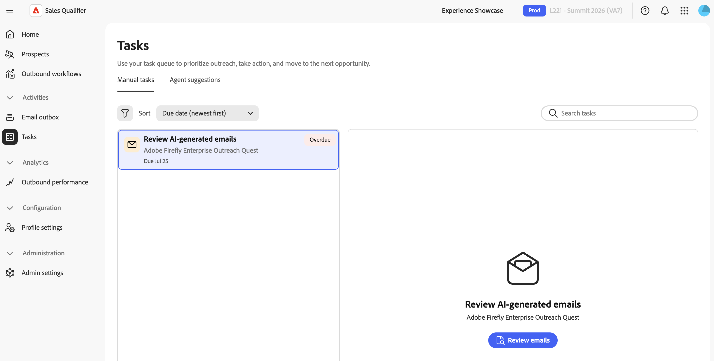
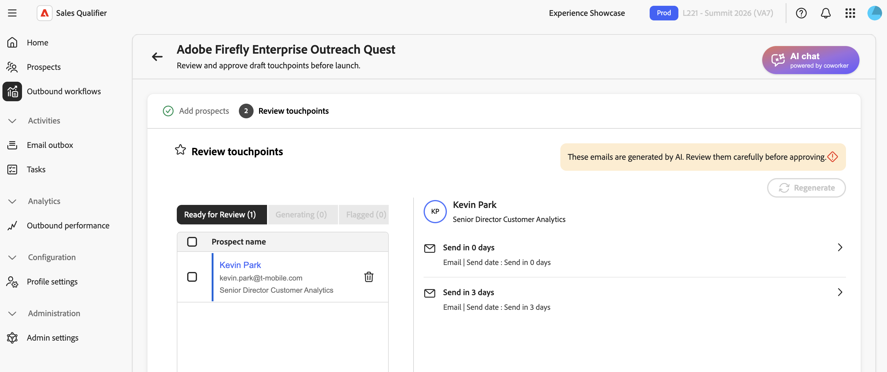

# Aufgaben

Verwenden Sie **[!UICONTROL Aufgaben]**, um die von ausgehenden Workflows generierten Aktionen abzuschließen. Wählen Sie eine Aufgabe aus, führen Sie eine Aktion durch, markieren Sie die Aufgabe als abgeschlossen und fahren Sie mit der nächsten Aufgabe fort, ohne die Seite zu verlassen.

Navigieren Sie in der linken Navigation zu **[!UICONTROL Aktivitäten]** > **[!UICONTROL Aufgaben]**.

## Aufgabenansichten

Die Seite weist zwei Registerkarten auf:

* **[!UICONTROL Manuelle Aufgaben]** - Telefonanrufe, LinkedInMails und E-Mail-Überprüfungen für Interessenten, die für einen ausgehenden Workflow registriert sind.
* **[!UICONTROL Agentenvorschläge]** - Interessenten, die den Zielgruppenkriterien eines ausgehenden Workflows entsprechen und für die Registrierung empfohlen werden.

Jede Registerkarte verfügt über eigene Filter, Sortieroptionen und ein Zwei-Bedienfeld-Layout. Die Aufgabenliste wird auf der linken Seite angezeigt, und das Bedienfeld Arbeit wird auf der rechten Seite angezeigt. Wenn Sie eine Aufgabe auswählen, werden deren Details im Arbeitsbereich geladen. Wenn Sie eine Aufgabe abschließen, wird die nächste Aufgabe automatisch ausgewählt.

## Manuelle Aufgaben

### Aufgabentypen

Manuelle Aufgaben sind an ausgehende Workflow-Schritte gebunden und können in drei Typen ausgeführt werden:

* **[!UICONTROL Telefonanruf]** - Wird erstellt, wenn eine Kadenz einen Telefonanrufschritt erreicht. Im Arbeitsbereich werden die Telefonnummer des Interessenten und, falls verfügbar, ein KI-generiertes Anrufskript angezeigt.

* **[!UICONTROL LinkedInMail]** - Wird erstellt, wenn eine Kadenz einen LinkedInMail-Schritt erreicht. Das Arbeitsfenster zeigt Inhalte an, die von LinkedIn kopiert und gesendet werden sollen. Erweitern Sie **[!UICONTROL KI-Begründung]**, um die Begründung zu überprüfen.

* **[!UICONTROL E-Mail-Überprüfung]** - Wird erstellt, nachdem [!DNL Adobe Marketo Qualifier] die personalisierten E-Mails eines Interessenten generiert hat. Um die Entwürfe zu überprüfen und zu genehmigen, bevor die Kontaktaufnahme beginnt, wählen Sie **[!UICONTROL E-Mails überprüfen]**. Siehe [Überprüfen und Verfeinern generierter E-Mails](outbound-workflows.md#review-and-refine-generated-emails).

### Das Bedienfeld „Arbeit“

Für eine **[!UICONTROL Telefonanruf]** oder **[!UICONTROL LinkedInMail]**-Aufgabe enthält das Arbeitsbedienfeld Folgendes:

* **[!UICONTROL Interessent]** - Name, E-Mail-Link und Telefonnummer des Interessenten, falls zutreffend.
* **[!UICONTROL Ausgehender Workflow]** - Der Name des verknüpften ausgehenden Workflows, das Fälligkeitsdatum und gegebenenfalls die Anzeige für automatisches Überspringen.
* **Aufgabeninhalt** - Das Aufrufskript oder der InMail-Inhalt.
* **[!UICONTROL Notizen]** - Notizen werden automatisch gespeichert, wenn Sie eine andere Aufgabe auswählen. Sie können keine Notizen bearbeiten, nachdem eine Aufgabe abgeschlossen, übersprungen oder abgebrochen wurde.

### Erstellen eines Aufrufskripts

Wählen Sie für **[!UICONTROL Aufgabe]** Telefonanruf“ die Option **[!UICONTROL Anrufskript generieren]** aus. Wenn die Generierung abgeschlossen ist, wählen **[!UICONTROL Detailliertes Aufrufskript anzeigen]**. Wenn die Generierung fehlschlägt, versuchen Sie es erneut über das Bedienfeld.

### Aufgabenaktionen

In der Kopfzeile des Arbeitsbereichs stehen zwei Aktionen zur Verfügung:

* **[!UICONTROL Als abgeschlossen markieren]** - Verwenden Sie diese Aktion, nachdem Sie den Anruf getätigt, die InMail gesendet oder die E-Mails überprüft haben. Die Warteschlange wird zur nächsten Aufgabe weitergeleitet.
* **[!UICONTROL Überspringen]** - Verwenden Sie diese Aktion, wenn Sie den Schritt nicht abschließen können, aber den potenziellen Kunden im ausgehenden Workflow belassen möchten. Der Interessent geht zum nächsten Kadenzschritt über.

Telefonanruf- und LinkedInMail-Aufgaben können automatisch übersprungen werden, wenn sie über den konfigurierten Schwellenwert hinaus offen bleiben. Ein automatischer Überspringungsvorgang leitet den potenziellen Kunden durch die Kadenz weiter und wirkt sich nicht auf geplante E-Mail-Touchpoints aus.

### Filtern, Suchen und Sortieren

Die Symbolleiste oberhalb der Liste steuert, welche Aufgaben in welcher Reihenfolge angezeigt werden. Ihre Filter- und Sortieroptionen werden gespeichert und beim nächsten Öffnen der Seite erneut angewendet.

* **[!UICONTROL Filter]** - Öffnen Sie das Filterbedienfeld:
  * **[!UICONTROL status]**—**[!UICONTROL current]**, **[!UICONTROL upcoming]**, **[!UICONTROL overdue]**, **[!UICONTROL completed]**, **[!UICONTROL canceled]**, **[!UICONTROL skipped]**.
  * **[!UICONTROL Aufgabentyp]**—**[!UICONTROL E-Mail-Überprüfung]**, **[!UICONTROL LinkedIn]**, **[!UICONTROL Telefonanruf]**.
  * **[!UICONTROL Fälligkeitsdatum]**
  * **[!UICONTROL Ausgehender Workflow]** - Eine durchsuchbare Liste Ihrer ausgehenden Workflows.
* **[!UICONTROL Sortieren]** - Sortieren Sie nach Fälligkeitsdatum oder Erstellungsdatum. Die Sortierreihenfolge bestimmt auch die Reihenfolge, in der die Warteschlange voranschreitet.
* **[!UICONTROL Suchaufgaben]** - Suchen nach Aufgaben nach Interessentenname, Firmenname oder ausgehendem Workflow. Die Suche gilt mit aktiven Filtern.

Aktive Filter werden als Chips unter der Symbolleiste angezeigt. Um sie zurückzusetzen, wählen Sie **[!UICONTROL Alle löschen]** aus.

### Aufgabenstatus

Jede Aufgabe zeigt ihren aktuellen Status an:

| Status | Beschreibung |
| --- | --- |
| **[!UICONTROL Aktuell]** | Jetzt fällig und bereit zu handeln. Aktuelle Aufgaben zeigen kein Abzeichen an. |
| **[!UICONTROL Künftig]** | Der vorherige Schritt ist abgeschlossen, das Fälligkeitsdatum liegt jedoch in der Zukunft. Man kann früh handeln, wenn der Moment gekommen ist. |
| **[!UICONTROL Überfällig]** | Überfällig am und noch nicht abgeschlossen. Die Aufgabe ist für Aufmerksamkeit gekennzeichnet. |
| **[!UICONTROL Abgeschlossen]** | Sie haben die Aktion abgeschlossen und die Aufgabe als abgeschlossen markiert. |
| **[!UICONTROL Übersprungen]** | Sie haben den Schritt übersprungen oder er wurde automatisch übersprungen. Der Interessent kommt im ausgehenden Workflow voran. |
| **[!UICONTROL Abgebrochen]** | Das System hat die Aufgabe aufgrund einer ausgehenden Workflow-Änderung abgebrochen. |

Abgeschlossene, übersprungene und abgebrochene Aufgaben sind endgültig. Ihre Aktionen sind nicht mehr verfügbar und ihre Notizen sind schreibgeschützt.

## Agent-Vorschläge

Auf **[!UICONTROL Registerkarte]** Agentenvorschläge“ werden Interessenten aufgelistet, die den Targeting-Kriterien eines ausgehenden Workflows entsprechen und für die Registrierung empfohlen werden. Informationen zum Aktivieren von Recommendations finden Sie [Ausgehende Workflows](outbound-workflows.md).

Um einen Vorschlag im Arbeitsbereich zu überprüfen, wählen Sie ihn aus:

* Ein Kürzungs-Badge kennzeichnet jeden Vorschlag als **[!UICONTROL Neu]** oder **[!UICONTROL Zurück]**.
* Die Tabelle **[!UICONTROL Empfohlene Leads]** oder **[!UICONTROL Empfohlene Kontakte]** listet die vorgeschlagenen Interessenten mit Spalten für **[!UICONTROL Name]**, **[!UICONTROL Titel]**, **[!UICONTROL Konto]**, **[!UICONTROL Status]**, **[!UICONTROL EMail]** und **[!UICONTROL Zuletzt aktualisiert]**.

Es stehen zwei Aktionen zur Verfügung:

* **[!UICONTROL Interessenten überprüfen]** - Öffnen Sie den ausgehenden Workflow, um empfohlene Interessenten zu überprüfen und zu registrieren. Siehe [Interessenten hinzufügen und E-Mail-Generierung &#x200B;](outbound-workflows.md#step-5-add-prospects-and-start-email-generation).
* **[!UICONTROL Als abgeschlossen markieren]** - Schließen Sie den Vorschlag ab, nachdem Sie ihn überprüft haben.

Die **[!UICONTROL Agentenvorschläge]** enthält die Statusfilter **[!UICONTROL Aktuell]**, **[!UICONTROL Abgeschlossen]** und **[!UICONTROL Abgebrochen]**, einen Filter für ausgehende Workflows und eine Sortierung nach Erstellungsdatum.

### Interessenten mit einem Agentenvorschlag antworten

Wenn ein Interessent auf eine E-Mail antwortet, kann [!DNL Marketo Qualifier] eine In-Thread-Antwort entwerfen und als Aufgabe unter &quot;**[!UICONTROL &quot;]**. Der Entwurf verwendet den relevanten Kontext aus:

* Der vollständige E-Mail-Thread und nicht nur die neueste Nachricht.
* Ihr Wissenscenter-Marketingmaterial und Ihre Produktforschung.
* Kontosignale, wie z. B. aktuelle Nachrichten, Marketing-Interaktionen und CRM-Aktivitäten.
* Ihr gespeicherter [E-Mail-](profile-settings.md#email-drafting-context)).

Der Assistent passt die Antwort an die Absicht des potenziellen Kunden an. So kann er beispielsweise Zeiten über Ihren Buchungslink für eine Besprechungsanfrage anbieten, bei Interesse des potenziellen Kunden den Wert steigern, eine Produktfrage aus Ihrem Marketingmaterial beantworten, ein relevantes Asset freigeben, einen Einwand mit einem Unterscheidungsmerkmal ansprechen oder eine Niederdruckantwort verwenden, wenn der potenzielle Kunde dies aufschieben möchte.

Preisangaben, rechtliche oder Sicherheitsanforderungen, feindselige Reaktionen und unklare Anfragen bleiben dem Beauftragten für eine persönliche Antwort überlassen.

1. Öffnen Sie den Antwortvorschlag und überprüfen Sie den vollständigen Thread und die entworfene Antwort.
1. Um einen weiteren Entwurf zu erstellen, bearbeiten Sie die Antwort oder wählen Sie **[!UICONTROL Mit KI generieren]** aus.
1. Um die Antwort zu senden und den ausgehenden Workflow des Interessenten fortzusetzen, wählen Sie **[!UICONTROL Genehmigen und senden]** aus.

## Abschließen von Aufgaben aus einem ausgehenden Workflow

In der Ansicht **[!UICONTROL Interessenten des ausgehenden Workflows]** bietet ein manueller Touchpoint dieselben Optionen **[!UICONTROL Als abgeschlossen markieren]**, **[!UICONTROL Überspringen]** und Notizen. Wenn Sie dort eine Aufgabe abschließen, wird ihr Status auch auf der Seite **[!UICONTROL Aufgaben]** aktualisiert. Siehe [Ausgehende Workflows](outbound-workflows.md).

## Leere Zustände

* Wenn Sie keine Aufgaben zum Ausführen von Aktionen haben, wird in der Liste _Nachricht „Sie sind bis heute_.
* Wenn die Filter nicht mit den Aufgaben übereinstimmen, zeigt die Liste an, dass keine Aufgaben mit Ihren Filtern übereinstimmen.
* Wenn keine Aufgabe ausgewählt ist, werden Sie im Arbeitsbereich aufgefordert, eine Aufgabe auszuwählen. Um die Details anzuzeigen, wählen Sie eine Aufgabe aus.

>[!MORELIKETHIS]
>
>* [Ausgehende Workflows](outbound-workflows.md)
>* [Ausgehende Leistung](performance.md)
>* [Interessenten](prospects.md)
